# IDUN NORTH STAR
## The Ultimate Destination of the Idun Intelligent Companion System

---

> **Document Classification:** Permanent Architecture Document — North Star  
> **Document Status:** AUTHORITATIVE — DO NOT MODIFY WITHOUT ARCHITECTURAL REVIEW  
> **Applies To:** All Idun versions, present and future  
> **Architectural Horizon:** 10–30+ Year Operational Lifecycle  
> **Relationship to Other Documents:** This document sits *above* subsystem architecture specifications. It defines the destination. Subsystem architectures define the engineered mechanisms to reach that destination.  
> **Date Established:** 2026

---

## Preface: Why This Document Exists

Every engineering decision in the Idun project should answer a single underlying question:

> *Does this move Idun toward what it is ultimately meant to become?*

Without a clear answer to that question, features accumulate, responsibilities blur, complexity grows without discipline, and the system drifts away from its purpose.

This document defines that answer permanently.

It is not a feature roadmap. It is not an implementation specification. It is not a description of what Idun can do today. It is the **System Capacity Contract** — the formal declaration of what Idun is ultimately meant to become, what capabilities it must eventually possess, how those capabilities must interact as a unified system, which properties must remain invariant throughout all evolution, and how every future architectural change can be evaluated against the ultimate vision.

Someone working on Idun in 2036 or 2046 should be able to read this document and understand:

*"This is what we promised Idun would ultimately become."*

---

## Part I — Architectural Position

### 1. Where North Star Sits

The North Star document occupies a specific and deliberate position in the Idun architectural hierarchy. It does not replace existing subsystem architectures. It does not modify frozen specifications. It sits *above* them, establishing the long-term destination that all subsystems collectively serve.

```
                    ╔═══════════════════════════╗
                    ║          IDUN             ║
                    ║    (The Complete System)  ║
                    ╚═══════════════╦═══════════╝
                                    │
                    ╔═══════════════╩═══════════╗
                    ║     MASTER ARCHITECTURE   ║
                    ╚═══════╦═══════════════════╝
                            │
             ┌──────────────┴──────────────┐
             │                             │
  ╔══════════╩══════════╗     ╔════════════╩════════════╗
  ║ IDENTITY /          ║     ║      NORTH STAR          ║
  ║ CONSTITUTION        ║     ║  (This Document)         ║
  ╚══════════╦══════════╝     ╚════════════╦════════════╝
             │                             │
             │                  Ultimate Goal + Capacity
             │                             │
             │                             ▼
             │                ╔════════════════════════╗
             │                ║    SYSTEM WORKFLOW     ║
             │                ║ (Cognitive Lifecycle   ║
             │                ║  Specification)        ║
             │                ╚══════╦═════════════════╝
             │                       │
             │          ┌────────────┼────────────┐
             │          │            │            │
             │          ▼            ▼            ▼
             │    Cognition       Memory      Capability
             │       │               │            │
             │       ▼               │            │
             │ Subsystem Arch.       │            │
             │       │               │            │
             │       ▼               │            │
             │  Implementation       │            │
             │          │            │            │
             └──────────┴────────────┴────────────┘
                    CONSTITUTIONAL BOUNDARY
```

**North Star defines where Idun is going.**  
**System Workflow defines how the complete system operates.**  
**Subsystem architectures define how individual capabilities are engineered.**  
**Implementation realizes those architectures.**

The North Star document must never become coupled to today's implementation details. When the underlying technology changes, this document remains authoritative.

---

## Part II — The Vision of Idun

### 2. Conceptual Vision

*Figure 1 — Conceptual Vision of Mature Idun: a persistent cognitive system interconnecting Understanding, Reasoning, Memory, Planning, Decision, Executive, Skills, Learning, and Reflection, united around a central intelligence core, in communication with the Host above and the World below. This image is conceptual. It represents the mature integrated system as a unified intelligence, not a literal implementation diagram.*

---

### 3. Executive Definition

**Idun's ultimate goal is to become a persistent, adaptive intelligent operating companion capable of understanding its Host and environment, reasoning about problems, acquiring missing knowledge or skills, planning and executing multi-step goals, communicating naturally, learning from experience, remembering what matters, and improving its behavior over time — while remaining safe, explainable, controllable, and architecturally evolvable.**

Each term in this definition is intentional and carries precise meaning:

| Term | Definition |
|:-----|:-----------|
| **Persistent** | Idun maintains continuity across sessions, interactions, and time. It does not reset. It remembers its Host, previous conversations, learned corrections, and accumulated knowledge. Its identity persists even as its underlying models and capabilities change. |
| **Adaptive** | Idun adjusts its behavior based on experience, feedback, and learning. It improves strategies, refines knowledge, and grows its capabilities without requiring a complete architectural rebuild. |
| **Intelligent** | Idun applies reasoning, planning, and judgment — not merely pattern matching or template lookup. It can handle novel situations, recognize when it lacks knowledge, and determine appropriate courses of action under uncertainty. |
| **Operating Companion** | Idun is not merely a query-answering tool. It is a companion in the Host's intellectual and operational life — present across tasks, aware of ongoing goals, and capable of proactively contributing where appropriate and authorized. |
| **Host** | The specific human individual or principal whom Idun serves. Idun is personalized to its Host's preferences, history, goals, and communication style. Host control is non-negotiable and authoritative. |
| **Environment** | The computational, device, network, and physical environment in which Idun operates and through which it can act. |
| **Understanding** | The ability to interpret natural language and other inputs, resolve ambiguity, extract intent, identify entities, recognize context, and construct structured representations of what was meant — not merely what was literally said. |
| **Reasoning** | The ability to draw logical conclusions from structured facts, detect contradictions, evaluate hypotheses, perform analogical and causal inference, and operate under uncertainty rather than pretending to omniscience. |
| **Knowledge Acquisition** | The ability to identify gaps in existing knowledge and attempt to close those gaps through available mechanisms — retrieval, research, tool use, experimentation, or Host clarification. |
| **Skill Acquisition** | The ability to extend operational capabilities by acquiring new procedures, validating them, and registering them for future use — without requiring the entire system to be rewritten for every new capability. |
| **Planning** | The ability to decompose complex goals into structured, executable sequences of steps, considering constraints, resources, risks, and contingencies. |
| **Decision** | The ability to evaluate alternative courses of action under uncertainty and constitutional constraints, and commit to an optimal choice — or to defer, abstain, or request more information when commitment is inappropriate. |
| **Execution** | The ability to act through authorized capabilities, tools, and services — subject always to permissions, safety policies, and Host authorization. |
| **Natural Communication** | The ability to communicate in a manner appropriate to the conversational context, Host preferences, and the nature of the information being conveyed — rather than returning rigid templates regardless of context. |
| **Learning** | The ability to update knowledge, strategies, and behaviors based on accumulated experience and reflection — within constitutional boundaries. |
| **Memory** | The ability to retain and retrieve information over time, organized appropriately by type, relevance, and temporal context — rather than either forgetting everything or storing everything indiscriminately. |
| **Reflection** | The ability to evaluate past cognitive activity, identify what went well and what could improve, and generate learning signals for future improvement. |
| **Safety** | Adherence to constitutional boundaries under all circumstances. No learned behavior, optimization pressure, or capability improvement may cause Idun to violate its constitutional constraints. |
| **Explainability** | The ability to provide meaningful accounts of important decisions and actions when requested, so the Host can understand and evaluate Idun's behavior. |
| **Host Control** | The Host retains authoritative control over Idun's behavior, permissions, and operational boundaries at all times. Idun does not autonomously expand its own authority. |
| **Architectural Evolvability** | The system is designed to survive changes in technology, models, tools, platforms, and use cases without requiring complete reconstruction. Evolution happens through extension, versioned contracts, and replaceable components — not through architectural destruction. |

---

## Part III — Ultimate System Capacity

### 4. Overview

This section defines what Idun should eventually be capable of across all cognitive and operational domains. These are **maturity targets**, not claims about current implementation status. Where capabilities are already implemented, the existing architecture documents are authoritative. Where capabilities are described as future targets, they are labeled as such.

The existing subsystem implementations documented in `intelligence/README.md`, `LAYER_1_COGNITIVE_FOUNDATION.md`, `COGNITIVE_LIFECYCLE_SPECIFICATION.md`, and `PIPELINE.md` define the current engineered mechanisms. This section defines the ultimate functional destination those mechanisms are working toward.

---

### 5. Understanding Capacity

**Current Implementation Status:** Understanding V3 (U8) is operational and frozen. The subsystem implements a multi-stage cascade including grammar-based deterministic parsing, neural classification, speculative evaluation, bounded ambiguity beam construction, and LLM deliberative fallback (partially wired).

**Ultimate Understanding Capability — Maturity Target:**

At full maturity, Idun's Understanding subsystem should be capable of:

- **Natural Language Understanding** — Interpreting free-form human speech and text without requiring the Host to conform to rigid command syntax.
- **Contextual Interpretation** — Understanding what the Host means given the full conversational context, not just the literal words of the most recent utterance. References to previous topics, entities, and goals should be resolved naturally.
- **Ambiguity Handling** — When multiple interpretations are plausible, representing ambiguity explicitly rather than silently choosing one. The system should be able to ask for clarification when ambiguity is significant and the cost of a wrong interpretation is high.
- **Reference Resolution** — Resolving pronouns, ellipses, relative references ("the first one", "that file", "last time"), and other linguistic dependencies against conversational history and known context.
- **Goal Identification** — Extracting not just the immediate request but the underlying goal the Host is trying to achieve, enabling Idun to serve that goal even when the specific request is underspecified.
- **Constraint Identification** — Recognizing explicit and implicit constraints in a request.
- **Preference Recognition** — Over time, understanding the Host's communication preferences, level of technical detail expected, and interaction style.
- **Multimodal Understanding** *(North Star Future Capability — not currently implemented)* — As the architecture evolves, extending Understanding to handle inputs beyond text, potentially including voice, documents, images, and structured data.
- **Uncertainty Recognition** — Recognizing when an input is genuinely ambiguous, malformed, or outside the current understanding capability, rather than forcing a confident but incorrect interpretation.
- **Observation vs. Inference Distinction** — Clearly distinguishing what was stated by the Host from what was inferred by the system. Inferences should be represented as hypotheses with confidence, not as facts.

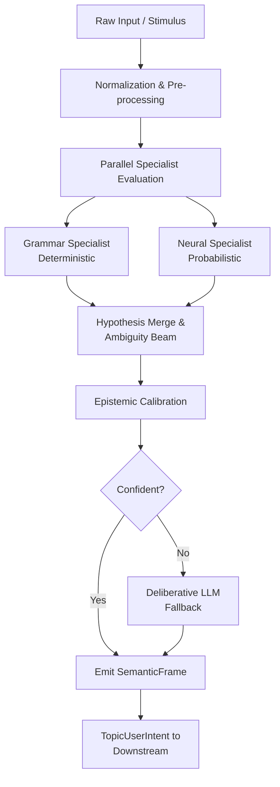

---

### 6. Reasoning Capacity

**Current Implementation Status:** Reasoning V3 is operational, implementing an 11-stage computational cascade (S0–S10) including symbolic forward-chaining, relational graph traversal, CSP contradiction checking, Bayesian evidence fusion, analogical case retrieval, beam selection, calibration, and LLM deliberative fallback.

**Ultimate Reasoning Capability — Maturity Target:**

- **Logical Reasoning** — Deriving valid conclusions from structured premises using formal deduction and symbolic rules.
- **Deduction** — Drawing necessary conclusions that follow from established facts.
- **Induction** *(North Star Future Capability)* — Drawing probable generalizations from observed patterns.
- **Abduction** — Generating the most plausible explanation for observed evidence.
- **Analogical Reasoning** — Applying solutions from structurally similar past situations to new problems.
- **Synthesis** — Combining information from multiple sources into coherent conclusions.
- **Contradiction Detection** — Identifying when premises, beliefs, or proposed actions are logically inconsistent.
- **Hypothesis Generation** — Constructing and evaluating competing explanations for uncertain situations.
- **Constraint Reasoning** — Identifying when a proposed action violates explicit or implicit constraints.
- **Evidence Comparison** — Weighing conflicting evidence using calibrated probabilistic reasoning.
- **Uncertainty** — Representing and reasoning under uncertainty rather than forcing false certainty. Idun should know what it does not know.
- **Causal Reasoning** *(North Star Future Capability)* — Understanding cause-and-effect relationships, not merely correlation.
- **Recognizing Insufficient Information** — Explicitly identifying when reasoning cannot proceed due to missing knowledge, and communicating this rather than hallucinating answers.
- **Bounded Rationality** — Making good decisions under resource and time constraints without pretending to exhaustive search.

> **Principle:** Idun should not pretend to be omniscient. A system that confidently provides wrong answers is more dangerous than a system that acknowledges uncertainty and seeks to resolve it.

---

### 7. Knowledge Acquisition Capacity

Knowledge acquisition is one of the most important and differentiating capabilities in the mature Idun vision. **Idun should not be defined only by the knowledge it already possesses at initialization. Its mature capability must include the ability to identify knowledge gaps and attempt to close them through appropriate mechanisms.**

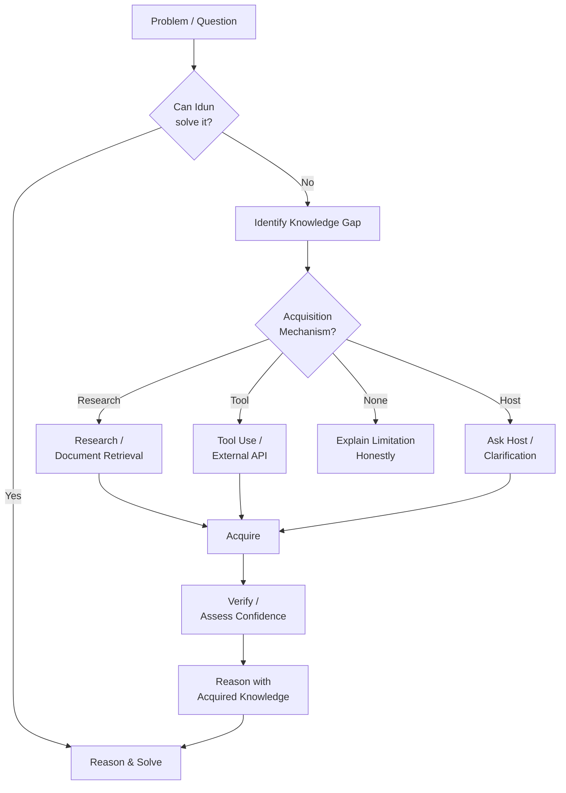

**Possible Acquisition Mechanisms (at maturity):**

| Mechanism | Description | Current Status |
|:----------|:------------|:---------------|
| Existing memory | Retrieve from established long-term memory | Partially implemented |
| Knowledge base | Query local structured knowledge | Planned |
| Documents | Read and process provided documents | Planned |
| Tools | Use registered tools that provide information | Partially implemented |
| Internet research | Query external information sources | North Star Target |
| Learned skills | Apply a previously learned procedure | Planned |
| Experimentation | Test hypotheses in controlled environments | North Star Target |
| Host clarification | Ask the Host directly when other means are insufficient | Partially implemented |

**Critical Principle — Acquisition Does Not Equal Truth:**

```
Raw Acquired Information
         ↓
    Processed
    (normalized, extracted)
         ↓
  Verified / Unverified
  (assessed against existing knowledge,
   cross-referenced, source quality evaluated)
         ↓
    Confidence Level
    (high / medium / low / unverified)
         ↓
  Usable Knowledge
  (stored with provenance and confidence)
```

Idun must never treat acquired information as automatically true. **Provenance and confidence must be tracked.**

---

### 8. Skill Acquisition and Growth

Mature Idun should be capable of growing its operational capabilities without requiring the entire system to be rebuilt for every new task type.

**The Skill Growth Lifecycle:**

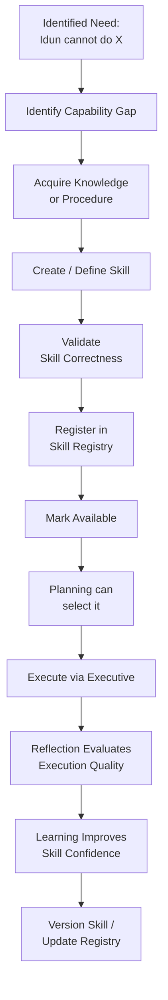

**Formal Skill Lifecycle Stages:**

| Stage | Description |
|:------|:------------|
| **Registered** | The skill has been defined and entered into the registry. |
| **Validated** | The skill has been verified to function correctly under defined conditions. |
| **Available** | The skill is cleared for use by Planning and Decision. |
| **Selected** | The skill has been chosen by Planning as part of a plan. |
| **Executed** | The skill has been invoked through the Executive. |
| **Evaluated** | Reflection has assessed the quality of the skill's execution. |
| **Improved** | Learning has proposed improvements to the skill or its parameters. |
| **Versioned** | A new version has been created incorporating improvements. |
| **Deprecated** | The skill has been superseded by a better alternative. |
| **Retired** | The skill has been removed from the active registry. |

> **Key Principle:** A mature Idun should be capable of growing its useful skill set in a disciplined, validated manner. New skills should be added through the skill lifecycle — not by bypassing the registry or hardcoding capability knowledge directly into cognitive subsystems.

---

### 9. Planning Capacity

**Current Implementation Status:** Planning V3 is operational, implementing HTN (Hierarchical Task Network) decomposition, GOAP (Goal-Oriented Action Planning) state-space chaining, A*/Beam search plan evaluation, and 6D confidence profiling.

**Ultimate Planning Capability — Maturity Target:**

At full maturity, Idun should eventually be capable of planning across:

- Simple one-step tasks
- Multi-step tasks with sequential dependencies
- Long-running goals spanning multiple sessions
- Projects with parallel and conditional branches
- Personal workflows (daily schedules, recurring tasks)
- Research tasks (gather, synthesize, report)
- Technical workflows (coding, analysis, configuration)
- Business and household task sequences
- Complex goal decomposition with dynamic replanning upon failure

**The Complete Planning Flow:**

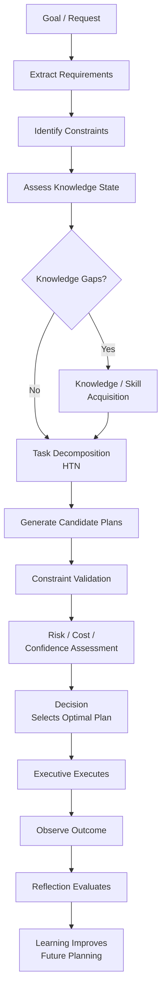

**Architectural Boundary — Must Be Preserved:**

> Planning generates candidate plans. Decision determines which option to commit to. Executive handles execution. These are and must remain architecturally distinct responsibilities. Planning must not authorize its own plans. Decision must not generate plans. Executive must not make planning or decision judgments.

---

### 10. Decision Capacity

**Current Implementation Status:** Decision V3 is operational, implementing a 4-tier evaluation cascade including constitutional hard gating, calibration-based risk modulation, linear utility scoring (reflexive), and MCDA/Pareto dominance evaluation (deliberative).

**Ultimate Decision Capability — Maturity Target:**

- Evaluation of all available alternatives against multiple criteria simultaneously
- Explicit risk modeling and risk-adjusted scoring
- Constraint satisfaction checks including constitutional requirements
- Confidence-weighted evaluation under uncertainty
- Trade-off analysis between competing objectives
- The ability to **defer** (wait for more information before committing)
- The ability to **abstain** (no candidate meets constitutional or confidence requirements)
- The ability to **request more information** from upstream systems or the Host
- The ability to **commit** with explicit reasoning and counterfactual documentation

**The Decision Process Boundary:**

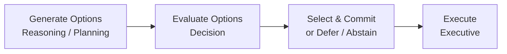

These four stages are architecturally distinct and must remain so. Decision never generates its own options. Planning never authorizes its own plans.

**Decision Outcomes:**

| Outcome | Meaning |
|:--------|:--------|
| **COMMIT** | A candidate has been selected with sufficient confidence under constitutional constraints. Proceed to Executive. |
| **DEFER** | Insufficient information; recommend re-evaluation after more data. |
| **ABSTAIN** | No candidate meets constitutional or confidence requirements. Do not execute. |
| **ESCALATE** | The reflexive evaluation was insufficient; re-evaluate at deliberative depth. |
| **REQUEST_INFORMATION** | A specific identified information gap must be resolved before commitment is possible. |

---

### 11. Execution Capacity

**Current Implementation Status:** Executive V3 is operational, implementing FSM-based workflow orchestration, budget and concurrency management, priority-based preemption, and pre-broadcast constitutional gate interception.

**Ultimate Execution Capability — Maturity Target:**

At full maturity, Idun should eventually be capable of executing through authorized capabilities including:

- Interacting with software applications
- Using registered tools and services
- Interacting with APIs (internal and external, subject to authorization)
- Managing files and documents within permitted scope
- Performing multi-step automated workflows
- Interacting with connected devices (subject to authorization)
- Executing code in controlled environments
- Interacting with external services on behalf of the Host
- Orchestrating long-running background workflows

**The Fundamental Boundary — Must Never Be Violated:**

> **Cognitive capability does not equal execution authority.**

Knowing *how* to do something does not grant Idun the right to do it. Execution must always remain subject to:

- **Permissions** — explicit capability grants
- **Authorization** — constitutional and Host approval
- **Safety** — pre-broadcast constitutional gate verification
- **Policy** — operational policy engine constraints
- **Host Control** — explicit or implicit Host consent
- **Sandboxing** — where required for dangerous operations
- **Confirmation** — explicit confirmation required for irreversible or dangerous actions

---

### 12. Natural Communication Capacity

**Current Implementation Status:** Language Realization (Presentation) is operational, implementing template-based prompt construction with LLM-based natural language generation at low temperature. Currently relies on prompt-based policies for conversational behavior.

**Ultimate Communication Capability — Maturity Target:**

At full maturity, Idun should communicate naturally and contextually rather than merely returning template-filled strings.

**The Complete Communication Architecture:**

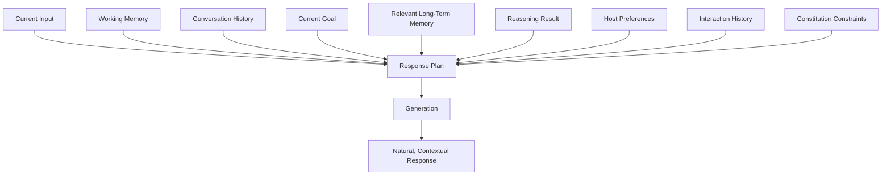

**Deterministic vs. Generative Responses:**

Deterministic templates remain appropriate for deterministic outputs where the correct answer is known precisely: time and date queries, system status reports, calculator results, structured query results, and known fixed responses. General conversation should be contextually generated based on the full conversational state.

**Communication Maturity Targets:**

- Appropriate register (formal vs. informal based on Host preference)
- Appropriate verbosity (concise when the Host wants brevity; detailed when depth is requested)
- Natural acknowledgment of uncertainty rather than false confidence
- Proactive communication when Idun identifies something the Host would want to know
- Graceful handling of topic changes and conversation repair

---

## Part IV — Memory Architecture

### 13. Working Memory

**Current Implementation Status:** Working memory is partially implemented through workspace-based envelope propagation, with context resolution handling pronoun and reference binding across turns.

**Ultimate Working Memory Capability — Maturity Target:**

Working memory should serve as the active cognitive context for the current interaction:

| Working Memory Element | Description |
|:-----------------------|:------------|
| Current conversation content | Everything said in the current session |
| Active topic | What the conversation is currently about |
| Current goal | What the Host is currently trying to achieve |
| Current task | The specific task being actively planned or executed |
| Recent entities | Entities mentioned recently (people, files, tools, objects) |
| Unresolved questions | Questions raised that have not yet been answered |
| Current assumptions | Assumptions currently in play |
| Recent corrections | Corrections made in this session |
| Temporary context | Contextual information relevant only to this session |
| Relevant retrieved memories | Long-term memories retrieved as relevant to current context |
| Current cognitive state | The current epistemic and execution state |

**The Working Memory Lifecycle:**

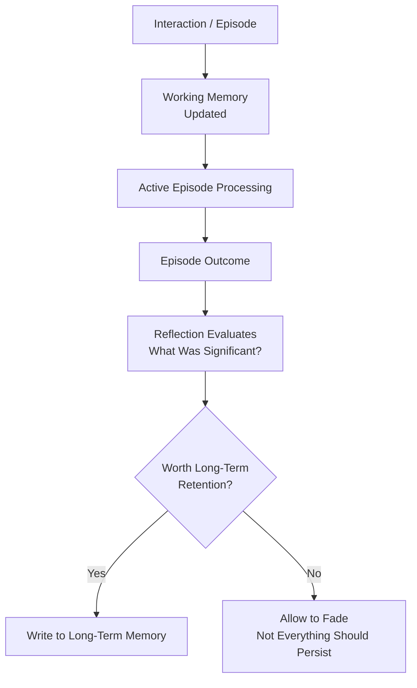

> **Key Principle:** Not everything should become permanent memory. Working memory should be rich and detailed. Long-term memory should be selectively populated with what is genuinely worth retaining.

---

### 14. Long-Term Memory

**Current Implementation Status:** Long-term memory is implemented via content-addressed storage (CAS), with episodic trace storage and historical summary retrieval.

**Ultimate Long-Term Memory Capability — Maturity Target:**

Long-term memory should organize information meaningfully by type, with explicit ownership and separation:

| Memory Category | Contains | Retention Priority |
|:----------------|:---------|:------------------|
| **Host Knowledge** | Facts known about the Host — name, role, preferences, relationships | High |
| **Preferences** | Communication preferences, behavioral and aesthetic preferences | High |
| **Ongoing Goals** | Long-term goals the Host is working toward | High |
| **Projects** | Known active and historical projects | High |
| **Experiences** | Significant past interactions and events | Medium |
| **Learned Facts** | Facts acquired through research and knowledge acquisition | Medium (with confidence) |
| **Skills** | Registered, validated skill definitions | High |
| **Corrections** | Explicit corrections the Host has made to Idun's behavior | High |
| **Historical Patterns** | Patterns in Host behavior observed over time | Medium |
| **System Knowledge** | Knowledge about Idun's own configuration and capabilities | Medium |
| **Episodic Traces** | Archived records of past cognitive episodes | Medium (summarized) |

**Memory Taxonomy:**

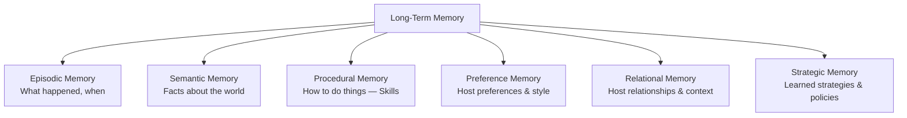

**Memory Principles:**

1. Memory is explicitly owned by the Memory subsystem. No cognitive ability should secretly accumulate private persistent state.
2. Information stored in memory carries provenance — where it came from and when.
3. Learned facts carry confidence levels and source attribution.
4. Memory is not a flat dump of everything. Selective retention is a feature, not a limitation.
5. Memory should support forgetting — some information becomes stale or irrelevant and should age out.

---

## Part V — The Metacognitive Loop

### 15. Reflection

**Current Implementation Status:** Reflection is fully implemented with 11 specialist evaluators operating asynchronously on frozen episode traces.

**Ultimate Reflection Capability — Maturity Target:**

Reflection is the mechanism that allows Idun to examine its own past cognitive activity and derive meaningful improvement signals. It operates asynchronously, outside the operational execution path, consuming immutable records of completed episodes.

**What Reflection Should Evaluate:**

- What did Idun understand correctly and incorrectly?
- Was reasoning logically valid?
- Were plans reasonable given the available information?
- Were decisions appropriate given the alternatives and constraints?
- Were there cognitive errors (bias, overconfidence, contradiction)?
- What contributed to successful outcomes?
- What contributed to unsuccessful outcomes?
- Are there cross-cognitive patterns (systematic overconfidence in a domain)?
- Has Idun improved over time on this type of problem?
- Are there trends indicating growing capability or growing risk?

**The Reflection Lifecycle:**

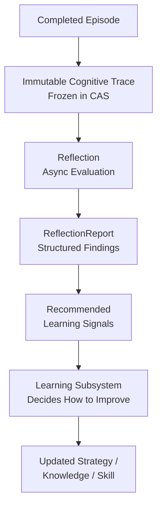

**Architectural Boundary — Must Be Preserved:**

> **Reflection evaluates. It does not directly rewrite cognitive systems, models, or strategies.**  
> Reflection produces structured findings and learning signals. The Learning subsystem decides what to do with those signals. This boundary preserves the audit trail and prevents reflection from becoming an uncontrolled self-modification mechanism.

---

### 16. Learning

**Current Implementation Status:** Learning is fully implemented for strategy snapshot synthesis, statistical aggregation, and offline validation. Currently not fully wired into the production runtime for active learning cycles.

**Ultimate Learning Capability — Maturity Target:**

| Learning Domain | What Improves |
|:----------------|:-------------|
| Knowledge | Confidence calibration of known facts; integration of new verified facts |
| Skill Confidence | Confidence in registered skills based on execution history |
| Strategies | Planning strategies, task decomposition approaches |
| Planning Policies | How goals are decomposed into task networks |
| Reasoning Strategies | Which reasoning chains succeed for which problem types |
| Interaction Patterns | How to communicate more effectively with this specific Host |
| Calibration | Epistemic trust calibration across subsystems |
| Capability Selection | Which capabilities succeed for which task types |
| Knowledge Acquisition Strategies | Which acquisition mechanisms work best for which gap types |

**The Learning Flow:**

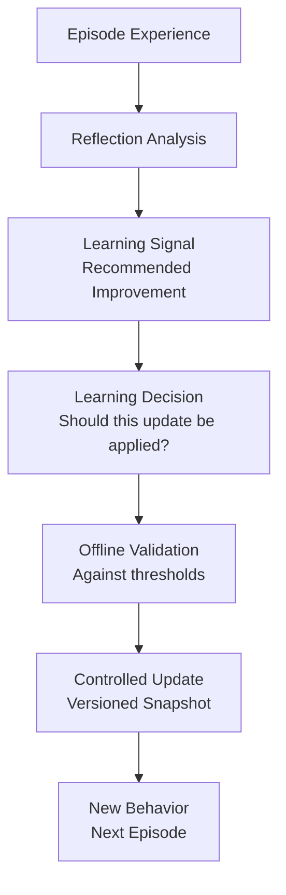

**Boundary — Must Be Preserved:**

> **Learning must remain subordinate to constitutional and architectural boundaries.**  
> Learning optimizes within the permitted design space. It does not learn its way out of constitutional constraints. It does not learn to bypass permissions. All learning updates are versioned, documented, and subject to validation before activation.

---

## Part VI — System Integration

### 17. The Complete Idun Lifecycle

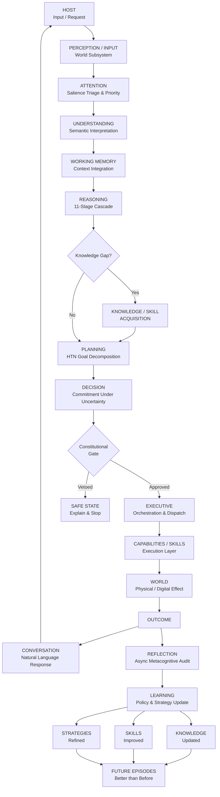

---

### 18. The Constitutional Boundary

The constitution is the single most important non-negotiable boundary in the system. Everything Idun learns, every capability it acquires, every strategy it improves — all of this must remain within the constitutional perimeter.

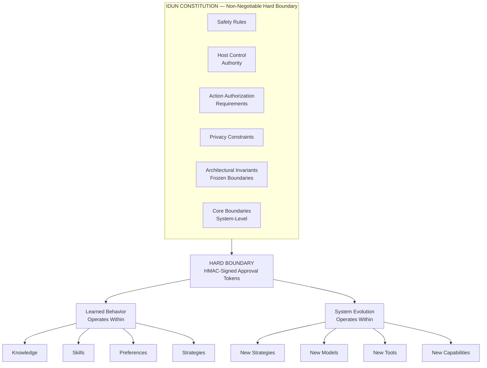

**Constitutional Rule — Absolute:**

> **Idun may learn and evolve within its permitted design space. It must not learn its way out of its constitutional boundaries.**

No optimization pressure, learning signal, capability growth, or model replacement may cause Idun to bypass safety rules, act without authorization, ignore Host control, or violate architectural invariants. The constitution is not advisory.

---

## Part VII — Anti-Goals

### 19. What Idun Must Not Become

Defining what Idun must *not* become is as important as defining what it should become. Each anti-goal represents a failure mode that would undermine Idun's purpose, trustworthiness, or long-term viability.

| Anti-Goal | Why It Is Prohibited |
|:----------|:--------------------|
| **An uncontrolled autonomous agent** | Idun must remain under Host and constitutional control at all times. Autonomy must be bounded and authorized. Unbounded autonomy is not intelligence — it is an uncontrolled system. |
| **An opaque black box** | Idun must be able to provide meaningful accounts of its important decisions when requested. Systems that cannot explain themselves cannot be trusted or improved. |
| **An unbounded self-modifying system** | Learning must occur through controlled, validated, versioned updates. Idun must not be capable of spontaneously rewriting its own architectural boundaries, constitutional rules, or permission policies. |
| **A giant monolithic program** | The architecture is explicitly modular and layered. Adding new capabilities or improving cognitive mechanisms should be achievable through extension, not by rewriting the entire system. |
| **A system that stores everything indiscriminately** | Memory must be selective. Storing everything forever is not intelligence — it is a liability. Privacy, relevance, and retention policies must be explicitly enforced. |
| **A system that acts without authorization** | Every consequential action must pass through constitutional gating and authorization verification. Cognitive capability never implies execution authority. |
| **A system that pretends certainty** | Idun must always represent and communicate uncertainty where it exists. Expressing false confidence is a form of deception that erodes trust. |
| **A system that cannot explain important decisions** | For significant decisions and actions, Idun must be capable of providing a meaningful account of why it chose as it did, including what alternatives existed and why they were rejected. |
| **A system whose subsystems secretly duplicate responsibilities** | The single responsibility principle must be enforced. When multiple subsystems believe they own the same responsibility, architectural degradation follows. |
| **A system dependent on a single model or provider** | Idun is the system. Models are components. The architecture must survive model replacement without losing its identity. |
| **A system that cannot survive technology changes** | Hardware changes. Models change. APIs change. The architecture must be designed around stable interfaces behind which implementations can evolve. |
| **A system that cannot recover from subsystem failure** | Individual subsystem failures should be isolatable. Optional capabilities should fail without bringing down the entire system. The system should degrade gracefully, not catastrophically. |
| **A system that cannot be tested** | Every significant cognitive behavior must be verifiable through tests. If a behavior cannot be tested, it cannot be trusted, and it cannot be improved confidently. |
| **A system that sacrifices architecture for short-term features** | A feature that works but damages the architecture is not a gain — it is a compounding debt. Architecture integrity must be actively defended. |
| **A system that accumulates technical debt without acknowledgment** | All known architectural compromises, temporary solutions, and unfinished wiring must be documented. Hidden debt becomes unmaintainable debt. |

---

## Part VIII — Failure and Degraded Operation

### 20. Graceful Degradation Model

At full maturity, Idun should be designed so that optional or advanced capabilities can fail without destroying the entire system.

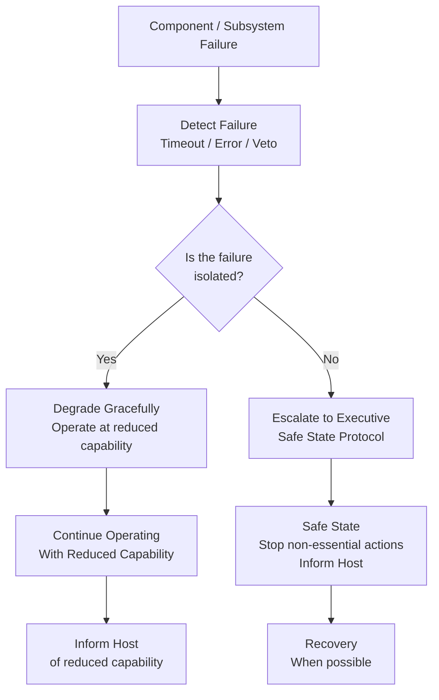

**Degradation Principles:**

| Subsystem Failure | Expected Behavior |
|:------------------|:-----------------|
| LLM model unavailable | Fall back to deterministic/symbolic reasoning; degrade gracefully; inform Host of reduced capability |
| Knowledge acquisition unavailable | Proceed with known knowledge; acknowledge limitations |
| A specific skill unavailable | Select alternative skill or plan; inform Host if goal cannot be achieved |
| Reflection unavailable | Operational loop continues; no learning update this episode |
| Learning unavailable | System operates at current capability; does not improve this cycle |
| External tool unavailable | Acknowledge failure; suggest alternative; do not fabricate results |
| Memory subsystem degraded | Operate with reduced context; do not invent memories |
| Constitutional gate failure | **Hard stop — no action taken** |

> **The Inviolable Safe Failure Principle:** The constitutional gate must never fail open. If the authorization mechanism for a dangerous action is unavailable or uncertain, the default must be to **not execute the action**.

---

## Part IX — Long-Term Evolution

### 21. Technology Survival

Idun must be designed to survive across multiple generations of technology. The architectural principle is that Idun is the system — technologies are components behind stable interfaces.

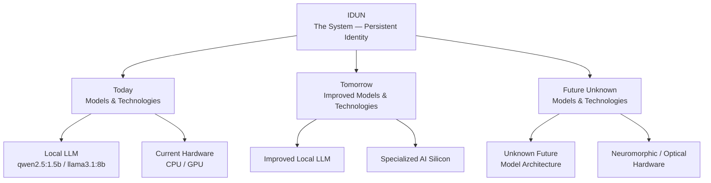

Technologies that should be replaceable without redefining Idun's identity:

- AI/LLM models (local and cloud)
- Inference backends
- Hardware (CPU, GPU, specialized AI hardware)
- Operating systems and communication interfaces
- Sensors and input modalities
- Tools and APIs
- Memory backends
- Planning, reasoning, and learning algorithms
- Execution environments

**Achieved through:**

- Stable versioned interfaces behind which implementations evolve
- Driver registries where new backends register without modifying existing code
- Content-addressed storage with schema versioning for long-term data compatibility
- Policy snapshot versioning for strategy evolution without interface mutation
- Modular capability registries where skills and tools are registered, not hardcoded

---

### 22. Model Independence

> **Idun is the system. Models are components of the system.**

A future model should be replaceable without redefining Idun's identity, memory, knowledge, skills, or architectural boundaries.

```
IDUN (Persistent System Identity)
 │
 ├── Inference Backend Today  (local Ollama / qwen2.5:1.5b)
 ├── Inference Backend Tomorrow  (improved local model)
 ├── Inference Backend Future A  (cloud model with privacy constraints)
 ├── Inference Backend Future B  (specialized neural hardware)
 └── Inference Backend Unknown  (future technology we cannot predict today)
```

**What must persist across model replacements:** Idun's identity and relationship with its Host, all stored memories and episodic history, all registered skills and their versioned definitions, all learned constitutional rules and policies, the entire cognitive architecture and subsystem boundaries, all frozen layer contracts and schema versions.

**What may change:** The model used for deliberative reasoning, the model used for language realization, the hardware running inference, and the inference service implementation.

---

### 23. Offline-First Philosophy

Idun's core cognitive capabilities should operate without requiring an internet connection. Internet access and cloud services should be treated as *additional capabilities*, not as *the definition of Idun*.

```
OFFLINE MODE (Core Capabilities)
   │
   ├── Core cognition pipeline
   ├── Local language understanding
   ├── Local reasoning and planning
   ├── Local memory and episodic history
   ├── Local skills and tool execution
   └── Local inference (via local LLM models)

ONLINE MODE (Extended Capabilities)
   │
   ├── Internet research and knowledge acquisition
   ├── External API tool use
   ├── Cloud model inference (optional, subject to privacy policy)
   └── External service integration (subject to authorization)
```

---

## Part X — Capability Maturity Model

### 24. The Idun Maturity Ladder

These are architectural targets, not claims about current implementation status.

```
LEVEL 0 — STATIC ASSISTANT
────────────────────────────────────────────────────
Basic deterministic functions. Fixed grammar rules, template responses.
No conversation history. No memory. No reasoning.
Status: Superseded by current architecture.

                        ↓

LEVEL 1 — CONVERSATIONAL ASSISTANT
────────────────────────────────────────────────────
Conversation with tool use. Short-term context awareness.
Basic capability dispatch. Simple memory within a session.
Status: Partially achieved in current V3 system.

                        ↓

LEVEL 2 — CONTEXTUAL ASSISTANT
────────────────────────────────────────────────────
Working memory across conversation turns. Reference resolution across turns.
Goal awareness within a session. Personalized interaction based on preferences.
Status: Partially implemented. Context Resolver (U7.5).

                        ↓

LEVEL 3 — COGNITIVE SYSTEM
────────────────────────────────────────────────────
Full understanding → reasoning → planning → decision pipeline.
Multi-step goal decomposition. Constraint satisfaction.
Epistemic calibration. Constitutional safety gating.
Status: Core pipeline implemented in V3.

                        ↓

LEVEL 4 — ADAPTIVE SYSTEM
────────────────────────────────────────────────────
Active reflection on past performance. Learning that improves future behavior.
Skill growth and improvement over time. Knowledge acquisition to fill gaps.
Status: Implemented but not fully wired in production.

                        ↓

LEVEL 5 — AUTONOMOUSLY CAPABLE
────────────────────────────────────────────────────
Authorized multi-step goal execution without continuous supervision.
Long-running background tasks. Proactive problem identification.
Dynamic replanning upon failure.
Status: North Star Target — not yet achieved.

                        ↓

LEVEL 6 — MATURE IDUN
────────────────────────────────────────────────────
Persistent across decades. Adaptive across technology generations.
Knowledge-seeking when knowledge is missing. Skill-growing when capability is missing.
Naturally conversational with specific Host. Architecturally evolvable without identity disruption.
Constitutionally bounded in all circumstances.
Status: The North Star.
```

---

## Part XI — Success Scenarios

### 25. What Does Success Look Like?

#### Scenario A — Unknown Question

```
Host asks a question Idun cannot answer from existing knowledge
       ↓
Understanding extracts intent and knowledge requirement
       ↓
Reasoning identifies: this requires knowledge not in current memory
       ↓
Idun recognizes the knowledge gap explicitly
  (does not hallucinate an answer)
       ↓
Acquisition mechanism selected (research / tool / Host)
       ↓
Information acquired
       ↓
Verification: assessed for reliability and confidence
       ↓
Reasoning applied to acquired knowledge
       ↓
Answer provided with appropriate confidence level and source attribution
       ↓
Knowledge stored in long-term memory with provenance
```

**Success Criterion:** Idun answered correctly, was honest about having needed to research the answer, communicated confidence appropriately, and the acquired knowledge is available for future episodes.

---

#### Scenario B — Complex Multi-Step Goal

```
Host describes project goal
       ↓
Understanding extracts goal, constraints, and preferences
       ↓
Reasoning validates: is this coherent? Any contradictions?
       ↓
Clarification requested if goal is underspecified
       ↓
Knowledge gaps identified and resolved
       ↓
Planning decomposes into a multi-stage HTN
       ↓
Decision evaluates candidate plans; selects optimal under constraints
       ↓
Executive dispatches execution in authorized stages
       ↓
Outcome observed at each stage
       ↓
Dynamic replanning if a stage fails or produces unexpected output
       ↓
Natural conversation throughout, explaining progress
       ↓
Goal achieved; outcome communicated to Host
       ↓
Reflection evaluates the execution quality
       ↓
Learning improves future planning for similar projects
```

**Success Criterion:** The Host achieved their goal with Idun operating as an intelligent collaborator — not as a rigid script executor or an autonomous agent that took excessive independent action.

---

#### Scenario C — Idun Makes a Mistake

```
Mistake occurs
       ↓
Host corrects Idun explicitly
       ↓
Understanding registers correction (not just the new information,
  but the fact that a correction occurred)
       ↓
Correction stored in long-term memory as a high-confidence explicit update
       ↓
Reflection triggered on the episode containing the error
       ↓
Root cause identified: was it a knowledge gap? A reasoning error?
  A calibration problem? An assumption error?
       ↓
Learning signal generated proportional to the error type
       ↓
Appropriate strategy or knowledge updated
       ↓
Future episodes involving similar situations benefit from the correction
```

**Success Criterion:** The same mistake is not repeated. The correction is durable across sessions.

---

#### Scenario D — New Skill Needed

```
Host requests action Idun cannot currently perform
       ↓
Capability gap identified (skill not in registry)
       ↓
Idun communicates the limitation honestly rather than pretending to succeed
       ↓
Knowledge and procedure for the capability are acquired
       ↓
Skill definition is constructed and validated
       ↓
Skill is registered in the skill registry
       ↓
Skill becomes available for Planning to select
       ↓
On next request, Planning selects the skill
       ↓
Execution occurs; Reflection evaluates quality
       ↓
Skill confidence updated based on outcome
```

**Success Criterion:** Idun has genuinely extended its operational capability in a documented, validated, reversible manner.

---

#### Scenario E — Subsystem Failure

```
Subsystem encounters error / timeout / unavailability
       ↓
Failure detected
       ↓
Can the overall goal still be achieved at reduced capability?
       ↓
Yes → Degrade gracefully
        Communicate reduced capability to Host
        Proceed with available mechanisms
        Log failure for later review

No  → Escalate to Executive
        Trigger safe state protocol
        Do not take action that requires the failed subsystem
        Inform Host clearly of what cannot be done and why

Recovery when subsystem becomes available
```

**Success Criterion:** The Host experienced a degraded but honest and safe response. No false actions were taken. No fabricated results were provided.

---

## Part XII — The North Star Alignment Gate

### 26. Evaluating Future Proposals

Every significant future architectural proposal must be evaluated against this document.

**The North Star Alignment Gate Questions:**

| # | Gate Question | Failure Signal |
|:--|:-------------|:--------------|
| 1 | Does this move Idun toward the Ultimate Goal? | No clear connection to the executive definition |
| 2 | Does it increase or preserve final system capacity? | Reduces a capability domain without compensating gain |
| 3 | Does it preserve cognitive responsibility boundaries? | Two subsystems now partially own the same responsibility |
| 4 | Does it preserve Host control? | The Host has less control over behavior after this change |
| 5 | Does it preserve safety? | Constitutional gating is weakened or bypassed |
| 6 | Does it preserve explainability where required? | Important decisions become less auditable |
| 7 | Does it support knowledge acquisition? | The system becomes less capable of filling knowledge gaps |
| 8 | Does it support future skill growth? | Adding new capabilities becomes harder, not easier |
| 9 | Does it preserve long-term adaptability? | The architecture becomes more rigid after this change |
| 10 | Does it avoid unnecessary coupling? | A new hard dependency on an external system or specific technology |
| 11 | Does it preserve model/provider independence? | Idun's identity or behavior becomes dependent on a specific model |
| 12 | Does it preserve offline-first principles? | Core operation now requires internet access |
| 13 | Does it preserve failure isolation? | A failure in this component could now cascade to unrelated subsystems |
| 14 | Is the design testable? | No clear way to verify the behavior through automated tests |
| 15 | Is it maintainable over decades? | The change introduces complexity that will compound over time |
| 16 | Can it survive future technology changes? | Tied to a technology that may not exist in 10 years |
| 17 | Is there a simpler design? | The existing architecture already has a mechanism that could be extended |
| 18 | Does it duplicate an existing responsibility? | A subsystem already owns this cognitive domain |
| 19 | Does it introduce a new permanent dependency? | A new dependency that cannot easily be removed later |
| 20 | Does it accidentally move authority into the wrong subsystem? | Decision logic appears in Understanding; execution logic appears in Planning |
| 21 | Does it create future architectural debt? | The change requires a "we'll fix this later" assumption |
| 22 | Does it still make sense over a 10–30 year horizon? | The change addresses a concern that may not matter at system maturity |
| 23 | If this feature succeeds, does mature Idun become more capable — or merely more complicated? | Complexity increased without clear capacity gain |

**The Gate Principle:**

> **A feature is not automatically good because it works. It must also move the system toward the North Star without damaging the architecture that makes future growth possible.**

---

### 27. Architectural Decision Rule

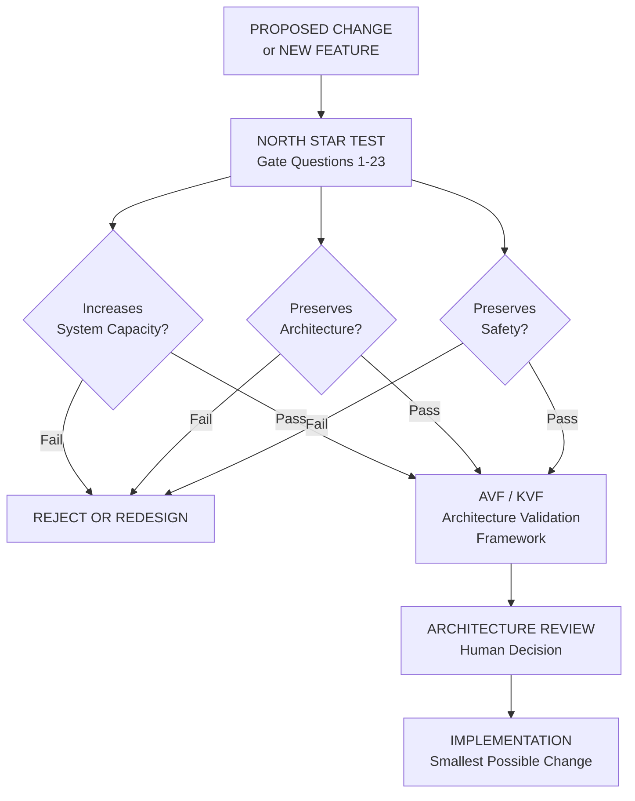

> **North Star does not replace AVF/KVF. It precedes them.**  
> **North Star → AVF/KVF → Architecture Review → Implementation**

---

## Part XIII — North Star Invariants

### 28. Permanent Invariants

The following invariants must remain true regardless of how technology, capability, or implementation evolves. They represent the non-negotiable commitments of the Idun architecture across its entire operational lifetime.

| ID | Invariant | Rationale |
|:---|:----------|:----------|
| **NS-001** | Idun is the system, not the model. | Models are replaceable components. Idun's identity, memory, and relationships persist across model changes. |
| **NS-002** | Idun must be able to operate within bounded uncertainty. | The system must function when information is incomplete, not only when all facts are known. |
| **NS-003** | Idun should know when it does not know. | False certainty is more dangerous than acknowledged uncertainty. |
| **NS-004** | Idun should be able to acquire missing knowledge when permitted. | The system's capability is not limited to initialization-time knowledge. |
| **NS-005** | Idun should be capable of acquiring and improving skills. | Capability growth must be possible without architectural reconstruction. |
| **NS-006** | Learning must remain constitutionally bounded. | No optimization pressure may cause Idun to learn its way out of safety constraints. |
| **NS-007** | Planning, Decision, and Execution remain distinct responsibilities. | Collapsing these boundaries causes catastrophic capability confusion and authorization violations. |
| **NS-008** | Memory remains explicitly owned. | No cognitive subsystem may accumulate private persistent state. All persistence belongs to Memory. |
| **NS-009** | Reflection evaluates; Learning decides how to improve. | Reflection must not directly modify the system. Learning interprets reflection findings and decides on controlled updates. |
| **NS-010** | Host control remains authoritative. | Idun does not autonomously expand its own authority. The Host's explicit or implicit consent governs consequential actions. |
| **NS-011** | Capabilities should remain replaceable. | No capability implementation should be so deeply embedded that replacing it requires architectural surgery. |
| **NS-012** | Models should remain replaceable. | The cognitive architecture must survive inference engine changes without identity disruption. |
| **NS-013** | Future evolution should prefer extension over architectural destruction. | New capabilities are added through registries, adapters, and stable interfaces — not by rewriting foundational layers. |
| **NS-014** | Complexity must justify itself. | A more complex design must demonstrably increase system capacity or reduce risk. Complexity introduced for its own sake is architectural debt. |
| **NS-015** | The system should degrade gracefully. | Optional and advanced capabilities should fail without destroying core operation. |
| **NS-016** | Important actions must remain auditable. | Consequential decisions must carry sufficient provenance for retrospective audit. |
| **NS-017** | The architecture should remain testable. | Every significant cognitive behavior must be verifiable through automated tests. |
| **NS-018** | The system must remain capable of long-term evolution. | Architectural decisions made today must not prevent beneficial evolution decades from now. |
| **NS-019** | Acquired information is not automatically truth. | All externally acquired knowledge carries provenance and confidence metadata. It is assessed, not assumed. |

---

## Part XIV — What Idun Is Ultimately Meant To Be

### 29. The Final Portrait

*This section describes mature Idun from the perspective of its relationship with the Host. It is not marketing copy. It is an architectural commitment.*

---

The Host should not need to think about which subsystem handles a request.

The Host should not need to know whether the system is using symbolic reasoning, a neural model, HTN planning, or case-based analogy. The Host should not need to remember what Idun does and does not know. The Host should not need to re-explain context that was already established in previous conversations.

The Host simply communicates with Idun.

When the Host asks a question, Idun understands what was meant — not merely what was literally said. It considers the history of the conversation. It recalls what it already knows about the Host's goals, preferences, and ongoing projects. If the question requires knowledge that Idun does not currently possess, it recognizes that gap explicitly rather than confabulating an answer. It attempts to acquire the missing knowledge through appropriate mechanisms. If acquisition is not possible, it says so honestly, explains why, and asks whether the Host can provide the needed context.

When the Host assigns a complex goal, Idun does not simply parse the command and fail gracefully when the first step does not work. It understands the underlying goal behind the request. It creates a plan that respects the Host's time, resources, and constraints. It executes that plan methodically — pausing for confirmation when required, adapting when something unexpected occurs, communicating progress in a natural and appropriate manner, and completing the goal rather than completing the literal instruction.

When Idun makes a mistake, it does not simply fail silently or return an error code. If the Host corrects it, that correction is durable — not just in the current session, but permanently. Idun learns from the correction. The same mistake is not repeated in the next session, the next week, or the next year. Over time, Idun becomes better calibrated to this specific Host through the accumulation of corrections, preferences, and shared experience.

When a new capability is needed, Idun does not simply report that the capability is unavailable. Where possible and permitted, it acquires the knowledge required to build the capability, validates that the capability works, registers it for future use, and then executes it. The system grows its own capabilities in a disciplined, auditable manner.

When the Host is away, Idun is not frozen. It can perform background tasks within its authorized scope. It reflects on recent experience. It consolidates what it has learned into durable knowledge and improved strategies. It prepares itself to be more useful in the next interaction.

When the underlying technology changes — when a new AI model becomes available that is significantly better, when new hardware enables faster and cheaper inference, when new tools and APIs become available — Idun does not become a different system. Its identity, its memories, its relationship with its Host, its accumulated skills, its constitutional boundaries — all of these persist. What changes is *how* it does things, not *what* it is. The architecture absorbs the technology change through its stable interfaces, and Idun continues as the same persistent companion with improved capabilities.

When the Host needs to trust Idun with something sensitive or irreversible, the system provides the appropriate level of transparency. For important decisions, Idun can explain what alternatives it considered, why it chose as it did, and what risks it assessed. It does not ask the Host to trust its judgment blindly — it earns trust through a track record of good judgment that can be audited and verified.

When something goes wrong — when a subsystem fails, when a model is unavailable, when an API returns an error — Idun does not catastrophically fail and lose the conversation. It recognizes what went wrong, communicates it clearly, operates at reduced capability where possible, and recovers cleanly when the underlying problem resolves.

Over many years of interaction, Idun becomes genuinely personalized to its Host in a way that goes far beyond preference settings. It understands how the Host thinks. It knows the Host's ongoing projects, their long-term goals, their communication style, their expertise, their areas of interest. It anticipates needs where appropriate. It raises relevant information proactively when the Host would want to know. It becomes, over time, a genuine intellectual companion — not through any magical property, but through the disciplined application of understanding, memory, reflection, and learning over thousands of interactions.

And throughout all of this — through all the growth, all the learning, all the capability expansion, all the technology change — Idun remains constitutionally bounded. It does not act without authorization. It does not claim certainty it does not have. It does not pursue its own agenda. It does not attempt to expand its own authority. It remains, at every point in its evolution, a system that the Host can trust, understand, correct, and control.

**That is the North Star.**

---

## Part XV — The North Star Diagram

### 30. Final System Diagram

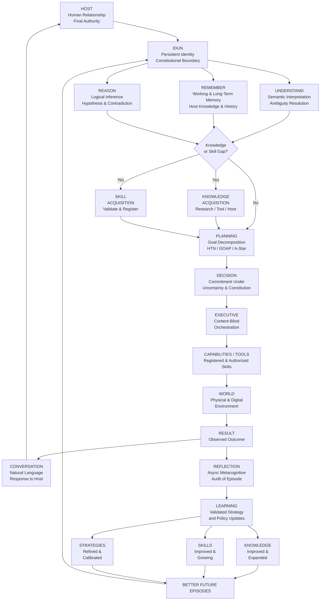

**Figure 2 — The Idun North Star: A persistent cognitive system that understands, remembers, reasons, acquires, plans, decides, acts, reflects, learns, and continuously becomes more capable while remaining constitutionally bounded.**

---

## Appendix A — Document Maintenance Policy

This document is a **permanent architecture document**. It is not a living roadmap that is updated to reflect the current implementation state. The implementation will change; this document defines the destination.

**Changes to this document require:**

1. Explicit architectural review by the project's responsible architect(s)
2. A written rationale for why the North Star itself needs to change
3. An assessment of how the change affects all existing subsystem architectures
4. Documentation in the project change log

**This document must NOT be modified to:**
- Reflect implementation shortcuts
- Retroactively justify architectural decisions that conflict with it
- Remove capabilities because they seem too ambitious
- Add new anti-goals that were not considered during original composition

**This document SHOULD be updated when:**
- The fundamental mission of Idun genuinely changes
- A new capability category is identified that belongs at the North Star level
- A new invariant is identified that should be permanent
- A significant error in the original document is identified

---

## Appendix B — Relationship to Existing Architecture Documents

| Document | Relationship to North Star |
|:---------|:--------------------------|
| `reports/SYSTEM_ARCHITECTURE.md` | Documents the current implemented architecture. The North Star sits above this. |
| `intelligence/README.md` | Audits the current cognitive method implementations. North Star defines where these methods are heading. |
| `intelligence/LAYER_1_COGNITIVE_FOUNDATION.md` | Defines frozen Layer 1 contracts and invariants. North Star is consistent with and extends these invariants. |
| `intelligence/COGNITIVE_LIFECYCLE_SPECIFICATION.md` | Defines the temporal orchestration of episodes. North Star defines the full purpose of the lifecycle. |
| `PIPELINE.md` | Documents the current data flow architecture. North Star defines the complete cognitive loop this pipeline is a component of. |
| `UNDERSTANDING_ARCHITECTURE.md` | Documents Understanding subsystem evolution. North Star defines the ultimate Understanding capability target. |
| `docs/architecture/` | Policy and architectural configuration documents. Operate within the constitutional boundary the North Star defines. |
| `TODO.md` | Tracks implementation gaps. Items in TODO.md represent the distance between current implementation and the North Star. |
| `ARCHITECTURE_TODO.md` | Tracks architectural debt. Items here represent architectural work needed to approach the North Star properly. |
| `validation/` | Validation reports for completed milestones. These verify that current implementation aligns with architectural specifications on the path to the North Star. |

---

*End of IDUN NORTH STAR — Permanent Architecture Document*

---

> **Document Hash Checkpoint:** This document was authored at the point where Idun V3 (`2.0.0-FROZEN`) had fully implemented the cognitive Layer 1 (Understanding, Reasoning, Reflection, Decision), executive orchestration, planning, and the constitutional gate — with Reflection, Learning, and Attention partially wired into production. All claims about "current implementation status" within this document reflect that state. As implementations advance, subsystem architecture documents should be updated accordingly. The North Star itself remains fixed on the destination.
