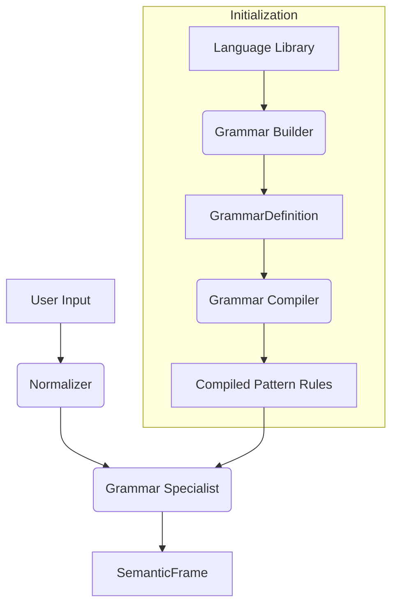

# Understanding Subsystem Architecture

## Overview
The Understanding subsystem is responsible for deterministically parsing, normalizing, and categorizing raw natural language user inputs into structured `SemanticFrame` representations. It acts as the definitive translation layer between raw human input and IDUN's internal cognitive capabilities.

## Evolution
* **U1 — Input Normalization:** Standardized casing, punctuation, and base text formatting.
* **U2 — Smarter Synonyms:** Introduced systematic aliasing for common semantic equivalences.
* **U3 — Filler Processing:** Stripped conversational filler words to isolate semantic intent.
* **U4 — Entity Normalization:** Introduced structured slots and entity recognition.
* **U5 — Capability Coverage:** Expanded grammar rules to cover domains (System, Time, Files, Notes, etc.).
* **U6 — Deterministic Language Engine:** Decoupled regex from semantic definition using a components-based builder and compiler.

**Current Status:** Frozen (U6)

## Final Architecture

## Layer Responsibilities

1. **Language Library (`grammar_components.go`)**: A frozen repository of predefined semantic fragments (e.g., `QueryPrefix`, `ConceptBattery`, `PropertyStatus`). Contains zero regex logic.
2. **Grammar Builder (`grammar_builders.go`)**: An API layer that strictly structures Language Components into domain-specific grammar rules (e.g., `BuildObjectPropertyQuery`).
3. **GrammarDefinition**: A declarative sequence of Language Components produced by Builders and passed to the Compiler.
4. **Grammar Compiler (`grammar_compiler.go`)**: The sole engine permitted to translate `GrammarDefinition`s into executable regular expressions (handling spacing, optionality, and capture groups).
5. **PatternRule (`*PatternRule`)**: The runtime wrapper containing the compiled regex (`*regexp.Regexp`) generated by the Compiler.
6. **Grammar Specialist (`evaluator.go` & `grammar.go`)**: Evaluates the normalized text against the active set of `PatternRule`s to return an intent, confidence, and slots.

## Design Principles
* **Semantic First**: Rules define language concepts, not regex strings.
* **Deterministic**: Identical inputs strictly produce identical outputs.
* **Compile Once**: All evaluation rules compile synchronously at startup.
* **Reuse Before Creation**: Existing Language Components must be used over creating new ones.
* **Layer Isolation**: The Compiler exclusively manages regex syntax; Builders exclusively manage sequences; the Specialist exclusively manages execution.
* **Backward Compatibility**: Any architectural change must yield 100% equivalence with the U5.1 baseline.
* **Single Responsibility**: Every component answers exactly one language question.

## Language Library
The Language Library is organized into semantic components:
* **Prefixes**: Action or Query prefixes that initiate a sentence (e.g., "what is", "create", "delete").
* **Concepts**: Target nouns and abstract entities (e.g., "battery", "weather", "file", "note").
* **Properties**: Specific state variables attached to Concepts (e.g., "status", "usage").
* **Slots**: Named extraction targets (e.g., "time", "location", "filename").
* **Connectors**: Syntactical glue words (e.g., "the", "in", "my").
* **Terminators**: Structural boundaries (e.g., Punctuation terminator).

## Builder Library
Builders enforce domain structuring so developers do not manually compose array sequences.
* `BuildRule`: The generic base builder constructing a sequence of `LanguageComponent`s. Used for complex sequences that don't fit a generic structure.
* `BuildObjectPropertyQuery`: Constructs sequences specifically formatted for querying properties of objects (e.g., "what is the battery status"). Used heavily in System capabilities.

## Compiler
**Responsibilities:**
- Converts semantic components into regex arrays.
- Implements spacing invariants (e.g., `\s+` vs `\s*`).
- Wraps slots in named capture groups (`(?P<name>...)`).
- Generates exact regex strings and invokes `regexp.MustCompile`.

**Restrictions:**
- Possesses no knowledge of business logic, intents, or system capabilities.
- Is the ONLY mechanism allowed to execute `regexp.MustCompile` for grammar evaluation.

**Guarantees:**
- Deterministic regex generation.
- Strict token isolation and boundaries.

## Certification
* **115 Phrase Certification:** The test suite `eval_phrases.go` asserts strict 1:1 parity with the legacy U5.1 baseline across 115 test utterances.
* **Zero Regressions:** Any modification must result in 0 failing tests and 0 changes to matched intent, slots, or confidence.
* **Builder Certification:** Verifies all instantiated rules pass correctly through the Builder layer.
* **Compiler Certification:** Ensures identical regex compilation execution on varied components.
* **Coverage Certification:** Verifies total capability coverage across inputs.
* **Regression Certification:** Validates against edge-case historical breakages.
* **Language Library Statistics:** Outputs metrics on component reuse versus duplication.

## Freeze Policy
**The U6 Architecture is FROZEN.** 
Future grammar additions or alterations require a new intentional migration phase. Direct bypass of Builders, manual injection of regex, or inline rule composition is strictly prohibited.

## Known Technical Debt
* **Raw User Input Preservation:** The Understanding layer discards the original raw utterance upon yielding a SemanticFrame. Future systems may require both the normalized frame and raw text.
* **Normalizer Coupling:** Some rules depend intrinsically on the Normalizer aggressively filtering conversational fillers. 

## Future Roadmap
* **U7**: Context Discovery & Multi-Turn Understanding
* **U8**: Reasoning Integration
* **U9**: Sub-Intent & Nested Processing
* **U10**: Adaptive Learning Hooks
