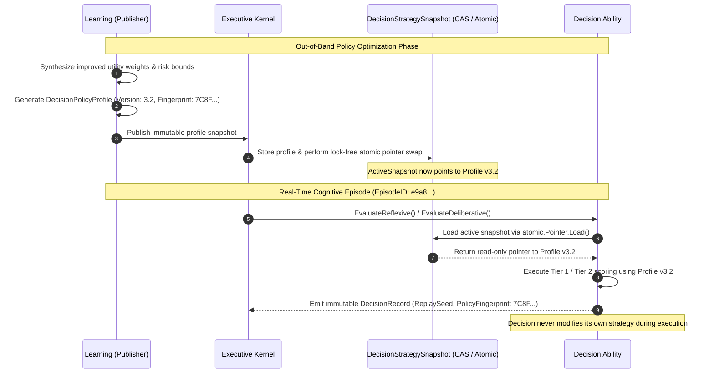
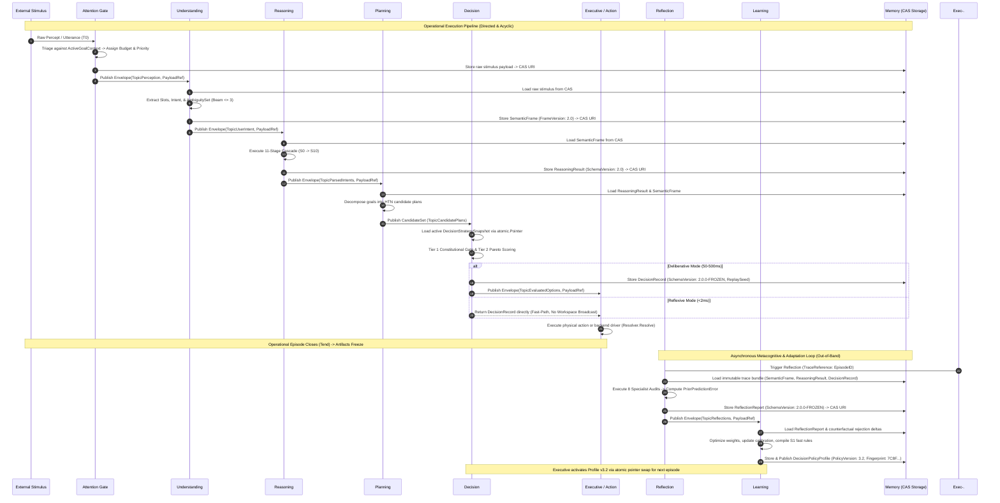
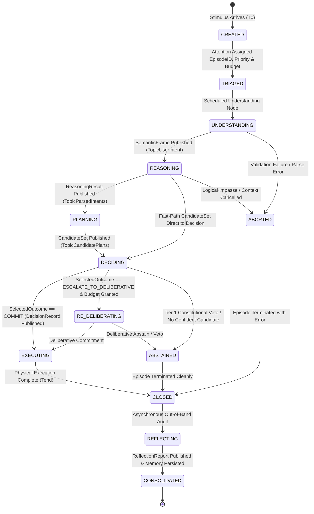

# IDUN V3 Cognitive Lifecycle Specification

**Document Title:** IDUN V3 Cognitive Lifecycle Specification  
**Architecture Version:** `1.0.0-FROZEN`  
**Classification:** Standard Temporal & Lifecycle Orchestration Specification  
**Target Scope:** Global Episode Lifecycle across all Cognitive Abilities (`Understanding`, `Reasoning`, `Planning`, `Decision`, `Reflection`, `Learning`, `Attention`, `Executive`, `Memory`)

---

## 1. Purpose & Scope

The **IDUN V3 Cognitive Lifecycle Specification** defines the standard, chronological lifecycle of every cognitive episode within IDUN. 

### What This Document Is
* A **temporal orchestration standard** specifying exactly when each cognitive ability wakes up, what it consumes, what it produces, when state transitions occur, and when artifacts freeze into immutability.
* A **system-level integration definition** connecting the frozen abilities of Layer 1 (`Understanding`, `Reasoning`, `Reflection`, `Decision`) with future cognitive abilities (`Attention`, `Planning`, `Learning`, `Executive Functions`, and `Memory`).

### What This Document Is Not
* **It is not a new cognitive subsystem.** It introduces zero new abilities, zero new domain algorithms, and zero new code packages.
* **It does not redefine or modify any frozen subsystem.** The responsibility boundaries and public interfaces of `idun/intelligence/understanding`, `idun/intelligence/reasoning`, `idun/intelligence/reflection`, and `idun/intelligence/decision` remain 100% frozen (`Version 2.0.0-FROZEN` / `Layer 1 Version 1.0.0-FROZEN`).

---

## 2. Episode Creation

Every cognitive episode represents a discrete, bounded quantum of cognitive work initiated to process an external stimulus, resolve a user intent, or satisfy an internal homeostatic drive.

### Who Creates an Episode?
An episode is instantiated exclusively by **Executive Functions** (`idun/intelligence/executive` — `WorkflowCoordinator`) upon the arrival of:
1. An external perception or user request via `TopicPerception`.
2. An internal goal trigger or homeostasis prompt (`HomeostasisController.ShouldConsolidate()`).
3. An escalation recommendation (`OutcomeEscalateToDeliberative`) emitted by a reflexive decision evaluation.

### How is `EpisodeID` Generated?
Upon instantiation, the `WorkflowCoordinator` generates a globally unique, cryptographically random 16-byte hexadecimal string (`EpisodeID = generateID()`, e.g., `"e9a84c2f10b37d6e4a8190c25f6b3e1a"`). This `EpisodeID` serves as the primary correlation header injected into the `context.Context` (`ctx = context.WithValue(ctx, ContextKeyEpisodeID, episodeID)`) and attached to all canonical communication envelopes throughout the episode's lifespan.

### When Does an Episode Begin?
An episode officially begins at the exact wall-clock microsecond ($T_0$) when the `WorkflowCoordinator`:
1. Instantiates a `WorkflowGraph` bounded by the assigned `EpisodeID`.
2. Registers the episode context (`ctx.CancelFunc`) with the `CancellationCoordinator.RegisterTask(episodeID, cancelFunc)`.
3. Assigns an initial execution budget (`BudgetTier`: `REFLEXIVE`, `STANDARD`, or `DELIBERATIVE`) via `BudgetManager.AssignBudget()`.

---

## 3. Attention (Future Subsystem)

Before cognitive parsing occurs, incoming sensory stimuli or messages pass through the **Attention Gate** (`idun/intelligence/executive` — `AttentionGate`).

### Stimulus Injection & Triage
1. **Activation:** Activated immediately at $T_0$ when raw or pre-processed sensory payloads arrive.
2. **Consumption:** Consumes raw stimulus data against the currently active goal header (`ActiveGoalContext`).
3. **Evaluation:** Evaluates triage salience (`Evaluate(s Stimulus) (SalienceDecision, PriorityBand)`), assigning the workflow to a priority queue (`PriorityBand 0..4`, where Band 0/1 represents emergency/safety interrupts).
4. **Publication:** Wraps the stimulus in a `communication.Envelope` and publishes it to `TopicPerception` (`"perception"`). It explicitly sets control-plane headers (`Urgency [0..100]` and `CostEstimateUnits`) without altering or parsing the underlying domain payload (`PayloadRef`).

---

## 4. Understanding (`idun/intelligence/understanding`)

Once a triaged perception envelope appears on the workspace, **Understanding** activates to extract structured semantic meaning.

### Activation & Consumption
* **When It Activates:** Immediately when the `WorkflowCoordinator` schedules the `UnderstandingAbility.ExecuteTask` node upon detecting a new `Envelope` on `TopicPerception`.
* **What It Consumes:** Consumes the immutable perception payload referenced by `Envelope.PayloadRef`, resolving the raw utterance, image frame, or structured event from content-addressed storage (CAS).

### Processing & Publication
* **Semantic Extraction:** Executes internal specialist layers (`LayerReflexiveGrammar`, `LayerNeuralClassifier`, or `LayerDeliberativeLLM`) to extract normalized semantic parameters (`Slots` with grounded referents `GroundingID`) and primary intent classification (`PrimaryHypothesis`).
* **Ambiguity Beam:** If multiple competing interpretations exist near the admission threshold $\tau$, Understanding constructs a bounded `AmbiguitySet` ($|H| \le \text{MaxBeamWidth} = 3$), explicitly quantifying `DeltaFromPrimary` ($P_{\text{eff}}(\text{primary}) - P_{\text{eff}}(\text{runner-up})$) without forcing premature disambiguation.
* **What It Publishes:** Publishes the canonical, validated `SemanticFrame` (`FrameVersion: "2.0"`) to `TopicUserIntent` (`"user-intent"`), wrapped in an `Envelope` referencing `EpisodeID`.

---

## 5. Reasoning (`idun/intelligence/reasoning`)

Once semantic meaning is normalized, **Reasoning** activates to derive logical conclusions, relational structures, and factual hypotheses.

### Activation & Consumption
* **When It Activates:** Triggered when the `WorkflowCoordinator` schedules the `ReasoningAbility.ExecuteTask` node upon publication of a `SemanticFrame` on `TopicUserIntent`.
* **What It Consumes:** Consumes the immutable `SemanticFrame` (`PayloadRef` resolution) and fetches relevant background working memory or premise graphs.

### The 11-Stage Cascade & Hypothesis Generation
* **Execution Cascade:** Executes the 11-stage computational cascade (`StageS0ContextAssembly` $\to$ `StageS1SymbolicFast` $\to$ `StageS2RelationalGraph` $\to$ `StageS3CSPCheck` $\to \dots \to$ `StageS10ResultAssembly`).
* **Hypothesis Modalities:** Derives verified conclusions (`ReasoningHypothesis`) classified by logical modality: `INFERENCE`, `RELATION`, `ANALOGY`, `ABDUCTION`, `CONTRADICTION`, or `DELIBERATIVE`.
* **Rule Compilation Candidates:** If a fast symbolic rule can be distilled from a slow deliberative derivation, Reasoning constructs a `CompilationCandidate` (`AntecedentConditions`, `CompiledConsequent`, `RulePriority`).
* **What It Publishes:** Publishes the canonical, validated `ReasoningResult` (`SchemaVersion: "2.0"`) to `TopicParsedIntents` (`"parsed-intents"`), carrying `PrimaryHypothesis`, `AmbiguitySet`, `ContradictionsFlagged`, and `StageTelemetry`.

---

## 6. Planning (Future Subsystem)

When an episode involves complex, multi-step goals or temporal sequencing, **Planning** (`idun/intelligence/planning`) bridges logical reasoning and final commitment.

### Activation & Goal Decomposition
* **When It Activates:** Activated when `WorkflowCoordinator` schedules `PlanningAbility.ExecuteTask` upon receipt of a `ReasoningResult` indicating a goal decomposition requirement.
* **Consumption:** Consumes `ReasoningResult` (`TopicParsedIntents`), `SemanticFrame` (`TopicUserIntent`), and `ActiveGoalContext` (`TopicActiveGoals`).
* **HTN Decomposition:** Decomposes top-level goals into Hierarchical Task Networks (HTNs), generating alternative multi-step execution plans ($c_1, c_2, \dots, c_k$).

### Publication to Decision
* **What It Publishes:** Packages the alternative candidate plans into a canonical `decision.CandidateSet` ($1 \le |C| \le 16$). Each `Candidate` contains unique path IDs, descriptions, multi-dimensional feature attributes (`Attributes map[string]float64`), cost estimates, and risk flags (`FlaggedRisks`). Publishes this structured set to `TopicCandidatePlans` (`"candidate-plans"`).

---

## 7. Decision (`idun/intelligence/decision`)

**Decision** acts as the definitive commitment engine of the operational loop, selecting the optimal course of action under uncertainty and constitutional boundaries.

### Activation & Consumption
* **When It Runs:** Triggered immediately when `CandidateSet` arrives on `TopicCandidatePlans` (via Planning) or directly from Reasoning (`TopicParsedIntents` / fast-path pipeline).
* **What It Consumes:** Consumes `CandidateSet` (by value) and lock-free read-only access to the active `DecisionStrategySnapshot` (`atomic.Pointer`).

### Two-Tier Evaluation & Modes
1. **Tier 1 Constitutional Hard Gate:** Filters all candidates against non-negotiable safety and constitutional constraints (`ConstitutionalConstraint`). Violating candidates are immediately rejected (`OutcomeAbstain` / `ConstitutionalReason`).
2. **Tier 2 Objective Utility Scorer:** Computes multi-criteria utility values (`Tier2Score`), Pareto dominance (`ParetoDominates`), and trade-off distances across remaining candidates.

#### Reflexive vs. Deliberative Execution Modes
* **Reflexive Mode (`REFLEXIVE_MICRO`):** Executes in **$<2\text{ ms}$** ($1.245\,\mu\text{s}$ benchmarked). Applies linear utility scoring or fast Pareto screening over bounded candidate sets. **To prevent workspace saturation, reflexive decisions skip Global Workspace broadcast entirely**, returning directly to the calling workflow while logging $O(1)$ local telemetry.
* **Deliberative Mode (`DELIBERATIVE_MACRO`):** Executes in **$50–500\text{ ms}$**. Applies deep Multi-Criteria Decision Analysis (MCDA), trade-off matrix generation, and information gap quantification (`IdentifyInformationGaps`). **Publishes a formal, immutable `DecisionRecord` to `TopicEvaluatedOptions` (`"evaluated-options"`)** via `PublishDeliberativeDecision()`.

### Escalation Recommendations (`OutcomeEscalateToDeliberative`)
When Reflexive evaluation determines that candidate scores are too close (`Delta < AmbiguityThreshold`) or critical information gaps exist (`Confidence < Tau`), Decision **does not automatically escalate or force a mode transition**. Instead, it emits an escalation recommendation (`SelectedOutcome: OutcomeEscalateToDeliberative`). The `WorkflowCoordinator` and `BudgetManager` intercept this recommendation and decide whether to allocate a `DELIBERATIVE` budget tier for a deep evaluation pass.

---

## 8. Executive (Future Subsystem)

**Executive Functions** (`idun/intelligence/executive`) acts as the continuous operating system kernel orchestrating the physical execution of cognitive decisions.

### Execution & Preemption
* **Workflow Execution:** When a `DecisionRecord` committing to an action (`SelectedOutcome: OutcomeCommit`) appears on `TopicEvaluatedOptions`, the `WorkflowCoordinator` routes the committed payload to the physical or infrastructure execution target (`BackendDescriptor` resolved via `Resolver.Resolve()`).
* **Budget & Concurrency Enforcement:** Enforces maximum concurrency (`MaxConcurrency`) and hard timeout boundaries assigned at $T_0$.
* **Priority Preemption:** If a `PriorityBand 0/1` (Emergency/Safety) stimulus arrives during an active `PriorityBand 2/3` episode, `PriorityEngine.Preempt(ctx)` immediately cancels the lower-priority `context.Context`. All frozen ability drivers (`ExecuteTask`) intercept `ctx.Done()`, halt processing instantly, and release hardware resources without corrupting CAS storage.

---

## 9. Reflection (`idun/intelligence/reflection`)

Once an operational episode completes, pauses, or aborts, real-time execution terminates and **Reflection** wakes up asynchronously out-of-band.

### Activation & Trace Freezing
* **When Reflection Begins:** Wakes up asynchronously (`ModeEpisode`) after the `WorkflowCoordinator` signals episode completion or failure, or on scheduled consolidation intervals (`ModePeriodic`).
* **Frozen Traces Consumed:** Consumes immutable `TraceReference` records referencing all CAS payloads generated during the episode (`SemanticFrame`, `ReasoningResult`, `DecisionRecord`, `StageTraceLog`). **Because these artifacts are content-addressed and frozen in CAS, Reflection evaluates a bit-exact, immutable historical record.**

### Metacognitive Audit & Publication
* **Specialist Evaluations:** Executes up to 8 independent specialists (`SpecialistReports`): `Bias`, `Contradiction`, `EpistemicCalibration`, `Safety`, `Efficiency`, `GoalAlignment`, `ContextRetention`, and `StrategyDrift`.
* **Error & Learning Signal Generation:** Quantifies prior prediction errors (`PriorPredictionError`) and formulates explicit weight-adjustment signals (`RecommendedLearningSignal`).
* **What It Publishes:** Publishes the canonical, validated `ReflectionReport` (`SchemaVersion: "2.0.0-FROZEN"`) to `TopicReflections` (`"reflections"`), making metacognitive findings available for long-term learning and self-calibration without injecting latency into operational loops.

---

## 10. Learning (Future Subsystem)

**Learning** (`idun/intelligence/learning`) operates entirely outside the operational decision loop, consuming historical traces and reflection reports to continuously evolve system intelligence over decades.

### Activation & Policy Optimization
* **When It Wakes Up:** Wakes up out-of-band upon arrival of `ReflectionReport` on `TopicReflections`, or during background homeostatic consolidation periods (`HomeostasisController.ShouldConsolidate()`).
* **What It Consumes:** Analyzes `RecommendedLearningSignal` (from Reflection), counterfactual rejection deltas (`RejectedAlternative.ScoreDelta` from Decision), and `CompilationCandidate` (from Reasoning).
* **How Policy Updates Occur:** Learning synthesizes parameter adjustments (utility weights, risk tolerances, escalation thresholds, and calibration offsets $w_{\text{cal}}$).

### Activation of Updated Policies
To guarantee that `Learning` never violates single-responsibility boundaries or breaks frozen ABIs:
1. Learning constructs a brand new, immutable `DecisionPolicyProfile` with an incremented `PolicyVersion` (e.g., `"3.2"`) and a unique cryptographic `PolicyFingerprint` (e.g., `"7C8F29E4..."`).
2. Learning publishes this snapshot out-of-band.
3. The `Executive` kernel (`StrategyProvider`) activates the new profile by swapping the atomic pointer inside `DecisionStrategySnapshot.ActiveSnapshot()`.
4. On the very next episode ($T_{0+1}$), `Decision` passively consumes the new snapshot via lock-free `atomic.Pointer` read.
5. Simultaneously, Learning compiles `CompilationCandidate` rules into fast S1 grammar entries and registers updated `BackendDescriptor` drivers via `ModelRegistry.Register()`.

---

## 11. Strategy Snapshot Lifecycle

The lifecycle of strategic parameters strictly decouples **creation**, **activation**, and **consumption**:

#### Strict Architectural Verification
* **Learning Owns Publication:** Only `Learning` (or authorized constitutional administrators) can create and publish a `DecisionPolicyProfile`.
* **Executive Owns Activation:** Only `Executive Functions` can perform the atomic pointer swap in `DecisionStrategySnapshot`.
* **Decision Owns Consumption:** `Decision` is a purely passive read-only consumer (`atomic.Pointer.Load()`). **No cognitive ability ever modifies its own strategic weights or policy parameters during operational execution.**

---

## 12. Episode Closure

An episode reaches formal **Episode Closure** ($T_{\text{end}}$) when real-time operational processing terminates and all associated data structures freeze into permanent persistence.

### Chronological Closure Sequence
1. **Workspace Artifact Freezing:** Upon CAS serialization and Global Workspace publication, all domain records (`SemanticFrame`, `ReasoningResult`, `DecisionRecord`, `CandidateSet`) become permanently immutable. No subsystem may mutate them in place.
2. **DecisionRecord Freezing:** Once `PublishDeliberativeDecision()` succeeds or reflexive evaluation returns, the `DecisionRecord` (carrying `SchemaVersion: "2.0.0-FROZEN"`, `DecisionID`, `ReplaySeed`, and `PolicyFingerprint`) is permanently locked. Reevaluations require emitting a new `DecisionRecord`.
3. **ReflectionReport Freezing:** Once `Reflection` completes its audit and publishes `ReflectionReport` (`SchemaVersion: "2.0.0-FROZEN"`), the audit findings freeze permanently.
4. **Telemetry Finalization:** The `WorkflowCoordinator` unregisters the episode context (`CancellationCoordinator.CancelTask(episodeID)`). `ReflexiveDecisionTrace` writes final aggregate counters and latency histograms to local ring buffers (`idun/intelligence/decision/telemetry.go`), and wall-clock duration timers (`ExecutionDuration`) finalize.
5. **Memory Persistence:** `Memory` (`idun/intelligence/memory` / `idun/core/storage`) sweeps all content-addressed artifacts linked by `EpisodeID` into non-volatile storage (`PayloadStorer`), updates longitudinal vector embeddings, and indexes `HistoricalSummary` entries for multi-decade trend audits.

---

## 13. Full Timeline & Diagrams

### 13.1 Episode Sequence Diagram

### 13.2 Episode State Transition Diagram

### 13.3 Timing & Budget Allocation Breakdown

| Stage / Phase | Target Horizon Budget | Execution Characteristics | Architectural SLA & Enforcement Mechanism |
| :--- | :--- | :--- | :--- |
| **Attention Triage** | $< 1\text{ ms}$ | $O(1)$ header inspection against active goal headers | Enforced by `AttentionGate.Evaluate` timeout. |
| **Understanding** | $5–20\text{ ms}$ | Bounded beam parsing ($|H| \le 3$ in `AmbiguitySet`) | Enforced by context timeout; falls back to `StatusPreliminary` if LLM parsing exceeds budget. |
| **Reasoning** | $10–50\text{ ms}$ | 11-stage cascade (`StageS0` $\to$ `StageS10`) | Enforced by `context.Context` deadline (`ErrReasoningTimeout`). Fast S1 symbolic rules execute in $<5\text{ ms}$. |
| **Planning** | $20–100\text{ ms}$ | HTN graph expansion and `CandidateSet` generation | Enforced by `WorkflowCoordinator` node limits ($|C| \le 16$ candidates maximum). |
| **Decision (Reflexive)** | $< 2\text{ ms}$ ($1.245\,\mu\text{s}$) | $O(1)$ Tier 1 filtering + Tier 2 linear/Pareto screening | Enforced by non-allocating execution (`BenchmarkEvaluateReflexive-12` = $1,245\text{ ns/op}$, 14 allocs). Skips workspace broadcast. |
| **Decision (Deliberative)** | $50–500\text{ ms}$ | Multi-Criteria trade-off matrices & Pareto frontier search | Enforced by `DELIBERATIVE` budget tier assignment. Publishes formal `DecisionRecord`. |
| **Executive Execution** | Variable ($10\text{ ms}–\text{seconds}$) | Physical backend invocation (`Resolver.Resolve`) | Enforced by `MaxConcurrency` and cooperative cancellation (`ctx.Done()`). |
| **Reflection (Out-of-Band)** | Asynchronous ($100\text{ ms}–2\text{ s}$) | 8 specialist audits across frozen CAS trace bundles | Runs entirely outside the real-time operational path; zero impact on operational SLAs. |
| **Learning (Out-of-Band)** | Asynchronous (Seconds to Hours) | Longitudinal weight optimization and S1 compilation | Runs during background homeostatic consolidation (`HomeostasisController.ShouldConsolidate()`). |

---

## 14. Failure Cases & Recovery Mechanics

During millions of episodes over decades, unexpected failures will occur. The cognitive lifecycle guarantees exact, deterministic recovery across all seven critical failure modes without leaving corrupted state or leaking memory.

| Failure Mode | Root Cause / Trigger | Interception & Architectural Recovery Mechanism | Final Episode State |
| :--- | :--- | :--- | :--- |
| **1. Timeout (`timeout`)** | A cognitive ability (`Reasoning`, `DeliberativeLLM`, or `Planning`) exceeds its assigned wall-clock deadline ($T_{\text{max}}$). | `context.Context` triggers `DeadlineExceeded`. The active `AbilityDriver.ExecuteTask` immediately aborts (`ErrReasoningTimeout`). The `WorkflowCoordinator` catches the timeout, logs a partial trace, and forces fallback to a preliminary hypothesis (`StatusPreliminary`) or transitions to `ABSTAIN`. | `ABORTED` $\to$ `CLOSED` (Clean resource release; partial trace saved to CAS). |
| **2. Cancellation (`cancellation`)** | `CancellationCoordinator.CancelTask(episodeID)` is invoked due to user abort or `PriorityBand 0/1` emergency preemption. | `ctx.Done()` channel closes instantly across all active threads. Running goroutines cleanly exit (`context.Canceled`). No partial or corrupted domain payload is written to CAS. | `ABORTED` $\to$ `CLOSED` |
| **3. Abstention (`ABSTAIN`)** | `Decision` evaluates all candidates and finds that none exceed confidence threshold $\tau$, or critical information gaps make commitment unsafe (`ErrInvalidConfidence`). | `Decision` returns `SelectedOutcome: OutcomeAbstain` with explanatory `InformationGaps` or rationale. No physical action is executed. Executive gracefully informs the user or requests clarifying candidates. | `ABSTAINED` $\to$ `CLOSED` (Valid cognitive outcome; audited by Reflection). |
| **4. Insufficient Data (`INSUFFICIENT_DATA`)** | `Reflection` attempts to audit an episode (`TraceReference`), but required stage traces (`StageTraceLog`) or CAS payloads are missing or corrupted. | Specialist evaluators return `VerdictInsufficientData` (`idun/intelligence/reflection/types.go`). `ReflectionReport` is published noting the data gap without generating bogus learning signals (`RecommendedLearningSignal` remains empty). | `CLOSED` $\to$ `CONSOLIDATED` (No learning update performed). |
| **5. Validation Failure (`validation failure`)** | Any ability receives an input or generates an output that violates structural invariants (e.g., `ErrInvalidSchemaVersion`, `ErrBeamOverflow`, out-of-bounds confidence $<0.0$ or $>1.0$). | `Validate()` firewall short-circuits execution immediately (`ErrInvalidDecisionRecord`, `ErrInvalidFrameVersion`). Bad payload is discarded before CAS serialization or workspace broadcast. | `ABORTED` $\to$ `CLOSED` |
| **6. Constitutional Veto (`constitutional veto`)** | An action candidate violates core ethical, safety, or constitutional rules (`Tier 1 Constitutional Gate` in Decision, or `ValueAbility.VerifyConstitutionalAlignment`). | `Decision` immediately vetoes the candidate (`OutcomeAbstain`, `ConstitutionalReason`). Or, `TopicValueFlags` (`"value-flags"`) fires a pre-broadcast safety override. Physical execution is completely blocked. | `ABSTAINED` $\to$ `CLOSED` (High-priority constitutional violation logged). |
| **7. Episode Interruption (`episode interruption`)** | A `PriorityBand 0` (Emergency Safety) stimulus arrives during an active `PriorityBand 2` or `3` episode. | `PriorityEngine.Preempt(ctx, Band0)` broadcasts preemption across all active Band 2/3 worker threads. The interrupted episode freezes its partial `StageTraceLog` into CAS and yields hardware CPU/GPU units instantly. The Band 0 episode begins within $<1\text{ ms}$. | Interrupted episode state = `ABORTED` / `PAUSED`. New Band 0 episode = `CREATED`. |

---

## 15. Long-Term Operation (20–30 Year Horizon)

To guarantee that millions of cognitive episodes can execute continuously over 20–30 years without system degradation, memory exhaustion, or architectural obsolescence, the lifecycle relies on four foundational engineering invariants:

### 15.1 Stateless Ability Drivers ($O(1)$ Memory Footprint)
Every cognitive ability (`Understanding`, `Reasoning`, `Planning`, `Decision`, `Reflection`) operates as a **stateless, pure computational transformation**. Because abilities retain zero cross-episode caching in private Go package structures, memory allocations per episode are strictly bounded and garbage-collected immediately at $T_{\text{end}}$. There are zero cumulative memory leaks across millions of invocations.

### 15.2 CAS Content Addressing & Schema Versioning
All persistent payloads (`SemanticFrame`, `ReasoningResult`, `DecisionRecord`, `ReflectionReport`) are stored in immutable Content-Addressed Storage (`idun/core/storage`) keyed by SHA-256 hash URIs (`PayloadRef`). Every payload explicitly carries its schema version string (`SchemaVersion: "2.0.0-FROZEN"` / `"2.0"`). When neural networks or underlying inference engines evolve in Year 15, historical records from Year 1 remain perfectly addressable and interpretable without schema collision.

### 15.3 Deterministic Replay Provenance (`ReplaySeed`)
Every `DecisionRecord` explicitly embeds `ReplaySeed uint64` along with `PolicyFingerprint` (`"7C8F29E4..."`) and `DecisionStrategySnapshot` metadata. For any historical episode executed over a 30-year span, developers, scientific auditors, or `Reflection` evaluators can re-inject the historical inputs and `ReplaySeed` into the frozen Layer 1 evaluation pipeline to reproduce the **exact, bit-identical decision outcome**, enabling rigorous scientific regression testing across decades of evolution.

### 15.4 Continuous Adaptation Without Interface Mutation
As `Learning` processes millions of `ReflectionReport` artifacts and counterfactual rejection deltas (`RejectedAlternative.ScoreDelta`), system intelligence increases monotonically:
* New `DecisionPolicyProfile` snapshots (`PolicyVersion: "104.8"`) are published out-of-band and atomically swapped by the Executive kernel (`StrategyProvider`).
* `CompilationCandidate` rules are distilled from slow LLM deliberations into lightning-fast S1 symbolic grammar entries (`LayerReflexiveGrammar`).
* Physical execution backends (`BackendDescriptor`) upgrade from local CPUs/GPUs to optical or neuromorphic hardware (`DriverScheme: "neuromorphic-pci"`) registered cleanly inside the `ModelRegistry`.

**Throughout this entire multi-decade evolution, the canonical public interfaces (`1.0.0-FROZEN` / `2.0.0-FROZEN`) and responsibility boundaries of Layer 1 remain 100% invariant, guaranteeing an immortal, mathematically rigorous cognitive architecture.**

---
**Cognitive Lifecycle Specification is permanently stabilized and frozen (`Version 1.0.0-FROZEN`). Proceed to Layer 2 (`idun/intelligence/planning`).**
