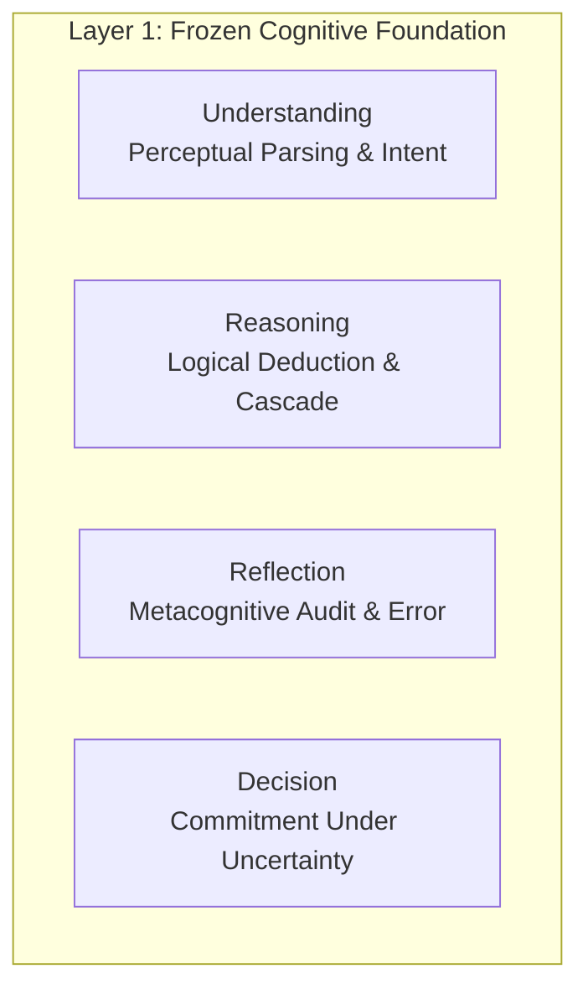
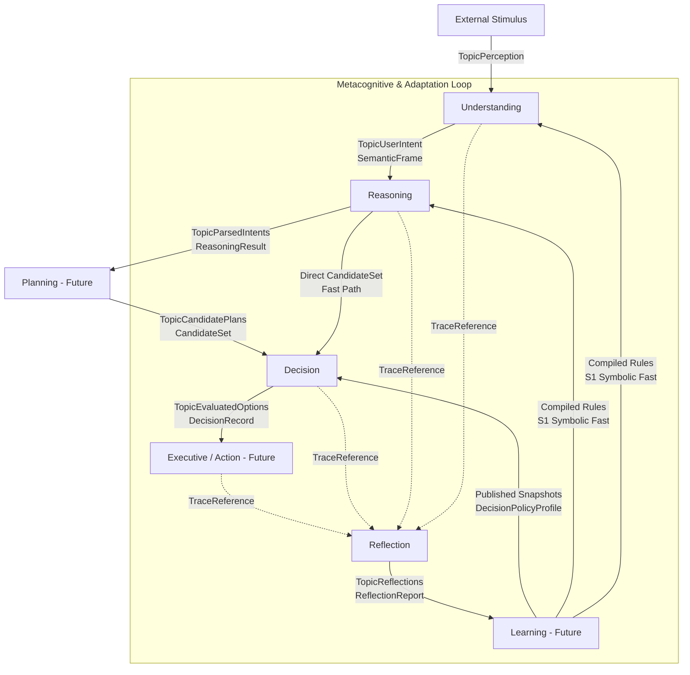
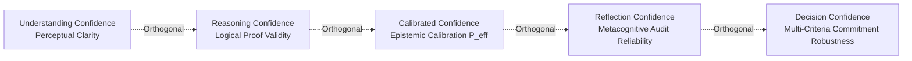
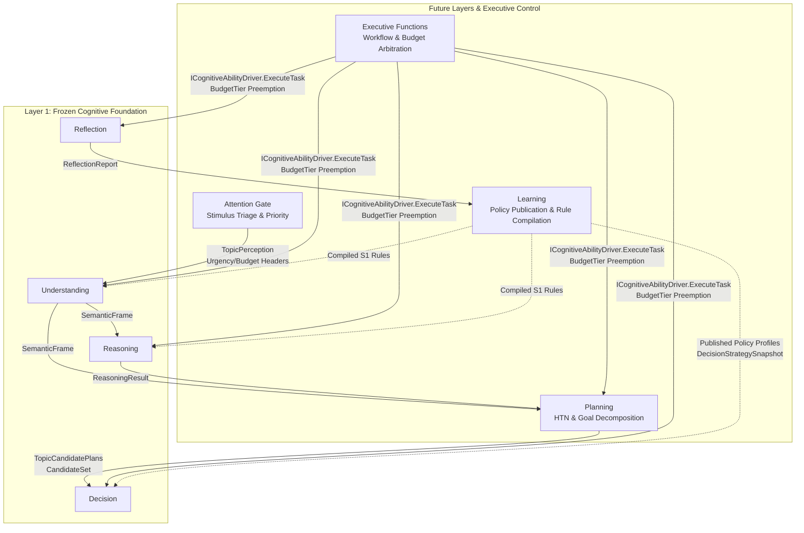

# IDUN V3 Layer 1 Cognitive Foundation

**Document Title:** IDUN V3 Layer 1 Cognitive Foundation  
**Architecture Version:** `1.0.0-FROZEN`  
**Classification:** Constitutional Architecture Specification for Layer 1 Cognitive Abilities  
**Target Scope:** `idun/intelligence/understanding`, `idun/intelligence/reasoning`, `idun/intelligence/reflection`, `idun/intelligence/decision`

---

## 1. Purpose

The **IDUN V3 Layer 1 Cognitive Foundation** establishes the immutable constitutional framework governing the foundational cognitive abilities of the IDUN intelligence pillar: **Understanding**, **Reasoning**, **Reflection**, and **Decision**.

### Why Layer 1 Exists
Layer 1 exists to provide the mathematical, logical, and structural bedrock of cognition. Before an autonomous intelligence can plan multi-step task networks, learn generalized skills, or orchestrate complex attention policies, it must possess four non-negotiable primitives:
1. The ability to interpret raw stimuli and resolve ambiguity into structured semantic meaning (**Understanding**).
2. The ability to draw logically valid deductions, synthesis, and abductive hypotheses from structured facts (**Reasoning**).
3. The ability to audit past cognitive episodes for biases, contradictions, and calibration drift (**Reflection**).
4. The ability to select and commit to optimal actions under uncertainty and constitutional constraints (**Decision**).

### Why This Document Exists
This document serves as the **constitutional boundary definition** and **system integration specification** for Layer 1. As IDUN evolves over a 20–30 year operational lifecycle, future advanced cognitive subsystems—namely **Planning**, **Learning**, **Attention**, and **Executive Functions**—will be built above and around Layer 1. This document defines exactly how those future systems must interact with Layer 1, establishing the mandatory invariants, invariants of immutability, and single-responsibility guarantees that safeguard against architectural degradation.

### Relationship to Subsystem Architectures
**This document does not replace, override, or redesign the individual subsystem specifications.** Each subsystem retains its own frozen architecture specification:
* `Understanding` Architecture Specification (`Version 2.0.0-FROZEN`)
* `Reasoning` Architecture Specification (`Version 2.0.0-FROZEN`)
* `Reflection` Architecture Specification (`Version 2.0.0-FROZEN`)
* `Decision` Architecture Specification (`Version 2.0.0-FROZEN`)

Instead, **IDUN V3 Layer 1 Cognitive Foundation** defines how these four frozen subsystems operate collectively as a coherent, integrated, first-class cognitive layer.

---

## 2. Architecture Overview



### Understanding (`idun/intelligence/understanding`)
Understanding is responsible for perceptual parsing, semantic normalization, argument extraction (`Slots`), and bounded ambiguity representation. When sensory percepts or natural language utterances arrive, Understanding transforms unstructured data into structured, canonical `SemanticFrame` records. When multiple competing interpretations exist near the admission threshold, Understanding preserves up to `MaxBeamWidth` (3) hypotheses within an `AmbiguitySet`, explicitly quantifying the calibrated probability delta without forcing premature disambiguation. **Its unique responsibility is to interpret meaning from stimuli.**

### Reasoning (`idun/intelligence/reasoning`)
Reasoning is responsible for logical deduction, relational graph synthesis, analogical mapping, constraint satisfaction, and hypothesis formulation. Operating across an 11-stage computational cascade, Reasoning consumes structured `SemanticFrame` records or factual premises and derives formally verified conclusions (`ReasoningHypothesis`). It classifies deductions across distinct logical modalities (Inference, Analogy, Abduction, Contradiction) and outputs compilation candidates for future rule learning. **Its unique responsibility is to generate logical conclusions and hypotheses from premises.**

### Reflection (`idun/intelligence/reflection`)
Reflection is responsible for post-hoc metacognitive evaluation, contradiction auditing, bias identification, and epistemic self-calibration. Operating outside the real-time operational execution path, Reflection consumes immutable episode traces (`TraceReference`) across completed cognitive cycles. It executes up to 8 specialized evaluators (`Bias`, `Contradiction`, `EpistemicCalibration`, `Safety`, etc.) to produce structured `ReflectionReport` artifacts containing exact error vectors and recommended learning signals. **Its unique responsibility is to evaluate and audit the quality of past cognition.**

### Decision (`idun/intelligence/decision`)
Decision is responsible for action selection and commitment under uncertainty. Consuming bounded sets of alternative options (`CandidateSet`) and externally provided policy parameters (`DecisionStrategySnapshot`), Decision executes a two-tier evaluation pipeline: a non-negotiable `Tier 1 Constitutional Hard Gate` that instantly vetoes safety violations, followed by a `Tier 2 Objective Utility Scorer` that computes multi-criteria trade-off matrices (`ParetoDominates`, `ComputeTradeoffDistance`) across Reflexive ($<2\text{ ms}$) and Deliberative ($50–500\text{ ms}$) horizons. **Its unique responsibility is to commit to the optimal action under uncertainty and constraints.**

---

## 3. Responsibility Matrix

To guarantee strict separation of concerns over decades of development, every cognitive function belongs uniquely to exactly one subsystem. No subsystem may usurp or duplicate the responsibilities of another.

| Cognitive Ability | Owns (Exclusive Responsibility) | Never Owns (Strictly Forbidden by Constitution) |
| :--- | :--- | :--- |
| **Understanding** | • Perceptual interpretation and decoding<br/>• Semantic slot and referent extraction<br/>• Multi-hypothesis beam construction (`AmbiguitySet`)<br/>• Publication of canonical `SemanticFrame` | • Drawing logical deductions or proofs (`Reasoning`)<br/>• Decomposing multi-step goal networks (`Planning`)<br/>• Selecting or committing to action options (`Decision`)<br/>• Mutating persistent memory or weights (`Learning`)<br/>• Auditing historical performance (`Reflection`) |
| **Reasoning** | • 11-stage logical and relational cascade<br/>• Derivation of conclusions (`ReasoningHypothesis`)<br/>• Detection of logical contradictions within premises<br/>• Identification of rule compilation candidates (`CompilationCandidate`)<br/>• Publication of canonical `ReasoningResult` | • Interpreting raw sensory text or stimuli (`Understanding`)<br/>• Selecting which action candidate to execute (`Decision`)<br/>• Scheduling future temporal tasks (`Planning`)<br/>• Modifying internal inference weights (`Learning`)<br/>• Storing permanent historical graphs (`Memory`) |
| **Reflection** | • Metacognitive audit of completed episodes<br/>• Cross-cognitive bias and contradiction analysis<br/>• Epistemic reliability scoring (`ReflectionReliability`)<br/>• Formulation of error signals (`RecommendedLearningSignal`)<br/>• Publication of canonical `ReflectionReport` | • Real-time operational decision making (`Decision`)<br/>• Direct execution or preemption of workflows (`Executive`)<br/>• Direct mutation of policy profiles or weights (`Learning`)<br/>• Generating forward action candidates (`Planning`)<br/>• Storing trace databases (`Memory`) |
| **Decision** | • Evaluation of candidate alternatives (`CandidateSet`)<br/>• Tier 1 Constitutional Hard Gate filtering<br/>• Tier 2 Objective Utility and Pareto trade-off scoring<br/>• Escalation recommendation (`OutcomeEscalateToDeliberative`)<br/>• Publication of canonical `DecisionRecord` | • Generating candidate options (`Reasoning` / `Planning`)<br/>• Selecting or mutating policy profiles (`Learning` / `Executive`)<br/>• Performing deductive inference (`Reasoning`)<br/>• Direct execution of physical actions (`Executive`)<br/>• Retaining semantic memory or decision history (`Memory`) |

---

## 4. Cognitive Pipeline



### Directed and Acyclic Information Flow
The operational execution path of Layer 1 is **strictly directed and acyclic**:
$$\text{Perception} \longrightarrow \text{Understanding} \longrightarrow \text{Reasoning} \longrightarrow (\text{Planning}) \longrightarrow \text{Decision} \longrightarrow \text{Action}$$

#### Why the Pipeline Must Be Acyclic
1. **Deadlock & Recursion Prevention:** If `Decision` could invoke `Reasoning` synchronously to evaluate a choice, which then invoked `Understanding` to re-parse the prompt, the system would enter unbounded recursion and violate hard real-time latency budgets ($<2\text{ ms}$ Reflexive, $<500\text{ ms}$ Deliberative).
2. **Epistemic Determinism:** A directed pipeline ensures that every cognitive artifact (`SemanticFrame`, `ReasoningResult`, `DecisionRecord`) depends strictly on antecedent inputs with immutable timestamps, making causal tracing bit-exact across decades.
3. **Decoupled Metacognition:** `Reflection` operates out-of-band as an asynchronous observer. It consumes completed historical traces from storage and emits `ReflectionReport` artifacts. It never injects control flow back into an active operational loop.

---

## 5. Workspace Communication

All inter-subsystem communication across Layer 1 is mediated strictly by the **Global Workspace control plane** defined in `idun/intelligence/communication/envelope.go`.

### `communication.Envelope`
Every cognitive output published across the boundary must be wrapped in a canonical `Envelope` structure:
```go
type Envelope struct {
    ID                string        // Unique content-addressed or random UUID
    Source            string        // Publishing ability (e.g., "CognitiveAbility.Reasoning")
    Topic             TopicID       // Leveled channel ID (e.g., "parsed-intents")
    ParentRef         string        // Correlation reference to antecedent envelope
    PayloadRef        string        // Immutable CAS storage URI in idun/core/storage
    PayloadModality   string        // Format hint ("structured-frame", "vector-ref")
    RawConfidence     float64       // Self-assessed domain certainty [0.0, 1.0]
    Urgency           int           // Priority override [0..100]
    CostEstimateUnits int           // Downstream computational cost estimate
    ExecutionDuration time.Duration // Wall-clock formulation time
    CreatedAt         time.Time     // UTC timestamp
}
```

### Leveled Topics
Subsystems publish and subscribe exclusively via registered, orthogonal channels (`communication.TopicID`):
* `TopicPerception` (`"perception"`): Raw or pre-processed sensory/world stimuli.
* `TopicUserIntent` (`"user-intent"`): Published by `Understanding`; carries `SemanticFrame`.
* `TopicCandidatePlans` (`"candidate-plans"`): Published by `Planning`; carries `CandidateSet`.
* `TopicEvaluatedOptions` (`"evaluated-options"`): Published by `Decision`; carries `DecisionRecord`.
* `TopicReflections` (`"reflections"`): Published by `Reflection`; carries `ReflectionReport`.

### Payload Ownership and CAS Storage
Cognitive abilities **never pass large structured payloads directly across memory channels**. Domain objects (`SemanticFrame`, `ReasoningResult`, `DecisionRecord`) are serialized to JSON and stored immutably in content-addressed storage (`PayloadStorer.Store`), yielding a canonical URI (`PayloadRef`, e.g., `"storage://cas/8f9a3b..."`). The `Envelope` carries only this URI reference.

### Single Writer Principle
Every leveled topic and canonical domain contract is governed by the **Single Writer Principle**:
* Only **Understanding** is authorized to publish to `TopicUserIntent` and create `SemanticFrame` records.
* Only **Reasoning** is authorized to publish to `TopicParsedIntents` and create `ReasoningResult` records.
* Only **Reflection** is authorized to publish to `TopicReflections` and create `ReflectionReport` records.
* Only **Decision** is authorized to publish to `TopicEvaluatedOptions` and create `DecisionRecord` records.

### Content-Blind Workspace
The Global Workspace bus and **Executive Functions** (`PriorityEngine`, `AttentionGate`, `WorkflowCoordinator`) inspect **only the control-plane fields of `communication.Envelope`** (`Topic`, `RawConfidence`, `Urgency`, `CostEstimateUnits`). **They are constitutionally forbidden from dereferencing, fetching, or parsing `PayloadRef`.** This guarantees that executive arbitration logic remains completely decoupled from domain payload schemas.

### No Private State Sharing
Subsystems do not share global variables, internal cache pointers, or private memory structures. All data exchange occurs strictly via immutable `Envelope` messages passing through the workspace or lock-free atomic pointer consumption of versioned snapshots (`StrategyProvider`).

---

## 6. Confidence Architecture

To prevent semantic conflation across complex multi-step workflows, Layer 1 enforces strict mathematical and definition orthogonality across **five independent confidence concepts**.



### 1. Understanding Confidence (`Hypothesis.CalibratedConfidence`, `Slot.Confidence`)
* **Definition:** The degree of perceptual clarity and structural fit between raw stimuli and a normalized semantic template $[0.0, 1.0]$.
* **Semantic Question:** *"How certain am I that the input text correctly maps to intent $H_0$ with parameters $S$?"*

### 2. Reasoning Confidence (`ReasoningHypothesis.ReasoningConfidence`)
* **Definition:** The formal proof validity, constraint satisfaction margin, or evidentiary support strength of a derived conclusion across the 11-stage cascade $[0.0, 1.0]$.
* **Semantic Question:** *"Assuming antecedent premises $P$ hold, what is the logical or analogical validity of conclusion $C$?"*

### 3. Calibrated Confidence (`Envelope.EffectivePriority`, $P_{\text{eff}}$)
* **Definition:** The system-wide epistemic certainty computed after adjusting raw confidence against historical prediction errors, domain uncertainty models, and computational cost.
* **Semantic Question:** *"Given our historical error rates on this topic and current urgency/budget ratios, what is the objective operational priority $P_{\text{eff}}$ of this bid?"*
* **Formula:** $P_{\text{eff}} = (\text{RawConfidence} \times w_{\text{cal}}) + (\text{Urgency} \times \alpha) - (\frac{\text{Cost}}{\text{Budget}} \times \beta)$

### 4. Reflection Confidence (`SpecialistReport.Confidence`, `SelfCalibrationReport.ReflectionReliability`)
* **Definition:** The metacognitive certainty of an audit finding or bias indicator $[0.0, 1.0]$.
* **Semantic Question:** *"How complete and reliable is the historical trace evidence supporting this contradiction audit?"*

### 5. Decision Confidence (`DecisionRecord.Confidence`, `Tier2Score.Confidence`)
* **Definition:** The commitment certainty of selecting alternative $c^*$ after multi-criteria utility trade-off scoring, Pareto dominance verification, and attribute coverage analysis $[0.0, 1.0]$.
* **Semantic Question:** *"How robust is action commitment $c^*$ against utility loss, tail risk, and constitutional constraints given current information gaps?"*

### Why They Cannot Be Merged
Merging these metrics creates fatal epistemic failures:
1. **High Perceptual Certainty $\neq$ Logical Validity:** Understanding may be $1.0$ confident that a user asked *"Prove $P \land \neg P$"*, but Reasoning confidence in the conclusion must be $0.0$.
2. **High Logical Proof Validity $\neq$ Decision Commitment Robustness:** Reasoning may be $1.0$ confident that action $A$ maximizes short-term revenue, but Decision confidence may be $0.10$ due to extreme tail risk or constitutional safety margins.
3. **Audit Certainty $\neq$ Operational Certainty:** Reflection may be $1.0$ confident (`ReflectionReliability`) that a past decision was completely wrong due to an information gap.

Each subsystem computes and outputs its domain confidence cleanly without overwriting upstream or downstream scores.

---

## 7. Memory Ownership

A core architectural invariant of IDUN V3 is that **Memory (`idun/intelligence/memory` and `idun/core/storage`) exclusively owns persistent state, retrieval indexing, and historical retention.**

### Computation-Only Layer 1
Layer 1 subsystems (**Understanding**, **Reasoning**, **Reflection**, **Decision**) are **pure computational execution engines**. They receive immutable input arguments, perform bounded mathematical/symbolic transformations, and emit immutable output records. They maintain **zero persistent cross-episode memory inside their internal package state**.

### Why No Subsystem May Become Hidden Memory
If a cognitive subsystem (e.g., `Decision` or `Reasoning`) accumulated private historical traces, learned weights, or cached past decisions inside local package maps:
1. **State Synchronization Drift:** Private caches would diverge from the central repository (`Memory`), causing split-brain decisions across distributed backend instances.
2. **Hidden Epistemic Bias:** Unaudited memory retention inside `Understanding` or `Reasoning` would introduce covert drift and bias not visible to `Reflection` or `Learning`.
3. **Memory Leaks Over Decades:** Over a 20–30 year operational lifecycle, unbounded private data retention would exhaust hardware RAM and degrade system stability.
4. **Privacy & Audit Violations:** `Decision` explicitly enforces the **Telemetry Privacy Invariant**: its local ring-buffered `ReflexiveDecisionTrace` holds only numeric decile bins and aggregate counters, strictly discarding all conversation text, prompts, and PII (`idun/intelligence/decision/telemetry.go`).

When a subsystem requires historical context, it requests it explicitly via versioned contracts from `Memory`. When it finishes an evaluation, its output artifact (`SemanticFrame`, `DecisionRecord`, etc.) is published to the Global Workspace for `Memory` to store.

---

## 8. Public Contracts

To ensure interoperability across decades, Layer 1 defines seven canonical, version-invariant domain contracts.

| Canonical Contract | Source Subsystem | Target Consumers | Purpose & Structural Guarantee |
| :--- | :--- | :--- | :--- |
| **`SemanticFrame`**<br/>([understanding/types.go:L167](file:///c:/Projects/idun_v3/intelligence/understanding/types.go#L167)) | `Understanding` | `Reasoning`<br/>`Planning`<br/>`Reflection` | Encapsulates normalized semantic intent (`PrimaryHypothesis`), extracted arguments (`Slots`), interpretation status (`InterpretationStatus`), and up to 3 bounded beam alternatives (`AmbiguitySet`). |
| **`ReasoningResult`**<br/>([reasoning/types.go:L312](file:///c:/Projects/idun_v3/intelligence/reasoning/types.go#L312)) | `Reasoning` | `Planning`<br/>`Decision`<br/>`Reflection` | Encapsulates derived conclusions (`PrimaryHypothesis`), contributing cascade stages (`StageIdentifier`), supporting premises, contradiction flags (`ContradictionFlag`), and rule compilation candidates (`CompilationCandidate`). |
| **`ReflectionReport`**<br/>([reflection/types.go:L320](file:///c:/Projects/idun_v3/intelligence/reflection/types.go#L320)) | `Reflection` | `Learning`<br/>`Executive`<br/>`Memory` | Encapsulates post-hoc metacognitive findings across 8 specialist evaluations (`SpecialistReports`), cross-cognitive bias indicators, trend analyses, and explicit weight adjustment recommendations (`RecommendedLearningSignal`). |
| **`DecisionRecord`**<br/>([decision/types.go:L140](file:///c:/Projects/idun_v3/intelligence/decision/types.go#L140)) | `Decision` | `Executive`<br/>`Reflection`<br/>`Learning` | Encapsulates the final commitment outcome (`SelectedOutcome`, `SelectedCandidateID`), deliberation depth (`DeliberationDepth`), full counterfactual rejection deltas (`RejectedAlternatives`), Pareto trade-off matrices, information gaps (`InformationGap`), and deterministic seed (`ReplaySeed`). |
| **`CandidateSet`**<br/>([decision/types.go:L91](file:///c:/Projects/idun_v3/intelligence/decision/types.go#L91)) | `Reasoning`<br/>`Planning` | `Decision` | Encapsulates a bounded collection of action alternatives ($1 \le |C| \le 16$). Each `Candidate` contains unique IDs, descriptions, source ability attribution, multi-dimensional feature vectors (`Attributes`), cost/benefit bounds, and risk flags. |
| **`HistoricalSummary`**<br/>(`idun/intelligence/types`) | `Memory` | `Reflection`<br/>`Reasoning` | Encapsulates compressed, multi-episode longitudinal trends and statistical summaries over extended time windows for periodic reflection. |
| **`communication.Envelope`**<br/>([communication/envelope.go:L27](file:///c:/Projects/idun_v3/intelligence/communication/envelope.go#L27)) | All Subsystems | Global Workspace<br/>`Executive` | The universal control-plane wrapper guaranteeing content-blind transport, priority calculation, cost accounting, and CAS payload correlation. |

### Why These Contracts Are Frozen
These contracts are permanently frozen (`SchemaVersion = "2.0.0-FROZEN"` / `"2.0"`) because:
1. **Decade-Scale Compatibility:** As underlying engines evolve from symbolic rules to quantized neural models or optical/neuromorphic hardware, downstream consumers (`Planning`, `Executive`, `Learning`) can continue consuming these structures without recompilation or contract breakage.
2. **Bit-Exact Auditability:** Frozen schemas guarantee that a `DecisionRecord` or `SemanticFrame` generated in Year 1 can be accurately parsed, replayed, and audited by `Reflection` in Year 25.

---

## 9. Layer 1 Invariants

Every subsystem and driver across Layer 1 strictly adheres to twelve non-negotiable constitutional invariants:

1. **Single Responsibility Invariant:** Every cognitive ability owns exactly one domain responsibility. No overlapping or duplicated cognitive tasks are permitted across subsystems.
2. **Single Writer Principle:** Each canonical contract (`SemanticFrame`, `ReasoningResult`, `ReflectionReport`, `DecisionRecord`) and leveled workspace topic is owned and published exclusively by its designated subsystem.
3. **Read-Only Inputs Invariant:** All input structs (`CandidateSet`, `SemanticFrame`, `DecisionStrategySnapshot`) are consumed strictly by value or via lock-free atomic pointers (`atomic.Pointer`). Subsystems must never mutate input arguments.
4. **Immutable Outputs Invariant:** Once a domain record (`DecisionRecord`, `ReflectionReport`) is published to the Global Workspace or returned from an evaluation engine, it becomes permanently immutable. Reevaluations must emit a brand new record with a new ID.
5. **Schema Versioning Invariant:** Every published record explicitly embeds its schema version string (`SchemaVersion`, `FrameVersion`). Any record missing or mismatching the canonical version is rejected immediately.
6. **Validation Firewall Invariant:** Every domain structure implements a strict structural `Validate() error` method. Subsystems execute this firewall immediately upon receipt of inputs and immediately prior to returning or publishing outputs (`PublishDeliberativeDecision`). Invalid records are discarded instantly.
7. **Deterministic Replay Invariant:** Given identical inputs (`CandidateSet`, `DecisionStrategySnapshot`, policy profile, and fingerprint), evaluation produces an exact, identical output record. Any stochastic or sampling mechanisms must record exact seed provenance (`ReplaySeed`) inside the output record.
8. **Privacy-Preserving Telemetry Invariant:** Operational telemetry (`ReflexiveDecisionTrace`) is strictly bounded to $O(1)$ numerical deciles, aggregate counters, and anonymized IDs. It must never capture raw prompts, natural language text, host messages, or PII.
9. **No Hidden Memory Invariant:** Layer 1 subsystems are pure computational execution engines. They must never persist cross-episode memory or state inside private package structures; all persistence belongs to `Memory`.
10. **Versioned Policy Snapshots Invariant:** `Decision` consumes policy parameters (`DecisionPolicyProfile`) strictly as passive, versioned, immutable snapshots (`PolicyVersion`, `PolicyFingerprint`). It never determines or mutates active profiles.
11. **Orthogonal Confidence Invariant:** Understanding, Reasoning, Calibrated, Reflection, and Decision confidence scores are calculated, stored, and exposed independently. They must never be mathematically conflated or overwritten.
12. **Directed Information Flow Invariant:** Operational execution flows strictly forward: $\text{Perception} \to \text{Understanding} \to \text{Reasoning} \to (\text{Planning}) \to \text{Decision} \to \text{Action}$. `Reflection` and `Learning` operate exclusively out-of-band as asynchronous observers.

---

## 10. Future Compatibility

The **IDUN V3 Layer 1 Cognitive Foundation** is specifically architected to support the future integration of **Planning**, **Learning**, **Attention**, and **Executive Functions** above and around Layer 1 without requiring a single line of code modification to frozen packages.



### Planning (`idun/intelligence/planning`)
* **Integration:** Planning sits cleanly between Reasoning and Decision.
* **Consumption:** It consumes `SemanticFrame` from `TopicUserIntent` to extract target goals, and consumes `ReasoningResult` from `TopicParsedIntents` to verify causal constraints and preconditions.
* **Production:** It formulates multi-step task networks and publishes alternative plan paths to `TopicCandidatePlans` wrapped as canonical `CandidateSet` records (`decision.CandidateSet`). `Decision` consumes these candidate plans natively using its frozen `Tier 1 Constitutional Gate` and `Tier 2 Objective Scorer`.

### Learning (`idun/intelligence/learning`)
* **Integration:** Learning sits out-of-band above Reflection.
* **Consumption:** It consumes `ReflectionReport` (`RecommendedLearningSignal`), `DecisionRecord` (`RejectedAlternative.ScoreDelta`), and `ReasoningResult` (`CompilationCandidate`).
* **Production:** To improve system intelligence over decades, Learning **does not modify internal subsystem APIs**. Instead, it acts as an authorized policy publisher:
  1. It optimizes and publishes versioned `DecisionPolicyProfile` artifacts (`PolicyVersion`, `PolicyFingerprint`) into `DecisionStrategySnapshot` for `Decision` to consume atomically.
  2. It compiles `CompilationCandidate` structures into fast S1 symbolic rules (`LayerReflexiveGrammar` / `StageS1SymbolicFast`) and registers them in the `ModelRegistry` without altering Reasoning or Understanding code.

### Attention (`idun/intelligence/executive` — `AttentionGate`)
* **Integration:** Attention sits upstream of Understanding at the stimulus boundary.
* **Consumption:** It inspects incoming world percepts on `TopicPerception`.
* **Production:** It triages stimuli against `ActiveGoalContext`, assigning `Urgency` headers and `BudgetTier` allocations before placing the stimulus onto the workspace for Understanding. Because Understanding and Reasoning consume standard `Envelope` payloads regardless of upstream triage, Attention operates orthogonally.

### Executive Functions (`idun/intelligence/executive`)
* **Integration:** Executive Functions (`WorkflowCoordinator`, `PriorityEngine`, `BudgetManager`, `AbilityRegistry`) acts as the operating system kernel for cognition.
* **Execution:** Every frozen ability implements the uniform `AbilityDriver` interface ([executive/interfaces.go:L113](file:///c:/Projects/idun_v3/intelligence/executive/interfaces.go#L113)):
  ```go
  type AbilityDriver interface {
      Ability() CognitiveAbility
      ExecuteTask(ctx context.Context, workflowID, nodeID string, budget BudgetTier, payloadRef string) (EpistemicStatus, string, error)
  }
  ```
  The Executive `WorkflowCoordinator` invokes `ExecuteTask` across Understanding, Reasoning, Reflection, Decision, and Planning seamlessly. When high-priority emergency interrupts (`Band 0/1`) arrive, `PriorityEngine` cancels the active `context.Context`, which all frozen abilities respect immediately.

---

## 11. Permanent Freeze

**IDUN V3 Layer 1 Cognitive Foundation (`Version 1.0.0-FROZEN`) is hereby permanently frozen.**

### Constitutional Declaration
1. **Permanence of Layer 1:** The architectural boundaries, public contracts, responsibility matrix, and twelve constitutional invariants established in this document are permanent. They represent the foundational cognitive layer of the IDUN intelligence pillar.
2. **Forbidden Redesign:** Future cognitive abilities (**Planning**, **Learning**, **Attention**, **Executive Functions**) are fully authorized to consume Layer 1 contracts (`SemanticFrame`, `ReasoningResult`, `ReflectionReport`, `DecisionRecord`), publish to Layer 1 input schemas (`CandidateSet`), and invoke Layer 1 drivers via `AbilityDriver`. **However, no future cognitive ability, developer, or automated learning loop is authorized to redesign, modify, break, or append responsibilities to Layer 1 packages (`understanding`, `reasoning`, `reflection`, `decision`).**
3. **Decade-Scale Evolution:** All future enhancements to Layer 1 capabilities must occur through open driver registration (`BackendDescriptor` in `ModelRegistry`), out-of-band policy snapshot publication (`DecisionPolicyProfile`), or S1 rule compilation (`CompilationCandidate`). The public ABIs and responsibility boundaries of Layer 1 remain immutable for the next 20–30 years.

**Layer 1 is permanently frozen. Proceed to Phase 1 of IDUN V3 Layer 2 (`idun/intelligence/planning`).**
