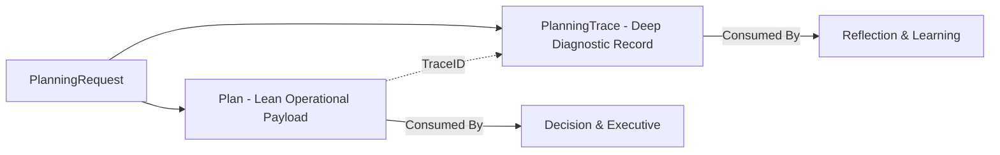
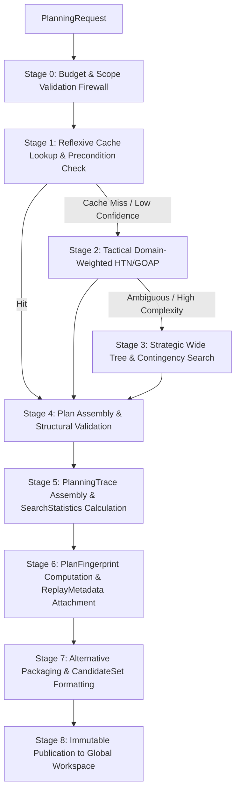

# IDUN V3 Planning Architecture Specification

**Document Title:** IDUN V3 Planning Architecture Specification  
**Architecture Version:** `2.0.0-FROZEN`  
**Classification:** Standalone Cognitive Ability Architecture Specification  
**Target Package:** `idun/intelligence/planning` (`CognitiveAbility.Planning`)  
**Dependencies:** Frozen Layer 1 (`Understanding`, `Reasoning`, `Reflection`, `Decision` — Version `1.0.0-FROZEN`)

---

## 1. Charter & Responsibilities

The **Planning** cognitive ability answers: *"How do I achieve this goal?"* Given a target goal and upstream context (`SemanticFrame`, `ReasoningResult`), Planning constructs immutable, versioned `Plan` objects accompanied by detailed `PlanningTrace` diagnostic artifacts and presents them to `Decision`.

### Exclusive Responsibilities (Owns)
1. **Multi-Step Goal Decomposition:** Breaking high-level target goals into Hierarchical Task Networks (HTNs), subgoals, and concrete operational tasks.
2. **Task Sequencing & Dependency Graph Construction:** Constructing directed acyclic dependency graphs across tasks, validating ordering constraints and precondition/postcondition chains.
3. **Resource & Temporal Estimation:** Estimating required computational/physical resources (`required_resources`), execution duration (`estimated_duration`), and monetary/compute budgets (`estimated_cost`).
4. **Alternative Path & Contingency Generation:** Generating bounded sets of alternative plan branches ($1 \le |C| \le 16$) and rollback strategies for high-risk operations.
5. **Multi-Dimensional Confidence & Information Gap Reporting:** Computing 6-dimensional `ConfidenceProfile` scores bounded by minimum aggregation, and explicitly surfacing structured `InformationRequirements` when information is missing.
6. **Escalation Recommendation:** Emitting explicit recommendations (`RECOMMEND_MORE_PLANNING`, `RECOMMEND_HIGHER_PLANNING_DEPTH`) when reflexive/tactical search yields ambiguous or low-confidence paths.

### Strictly Forbidden (Never Owns)
* **Never Interprets Sensory Text:** Does not perform perceptual parsing, argument extraction, or natural language intent classification (`Understanding` owns).
* **Never Performs Formal Proofs:** Does not execute the 11-stage logical cascade or resolve formal contradictions (`Reasoning` owns).
* **Never Selects or Commits to Action:** Does not choose the winning plan for execution or rank alternatives to recommend a single action (`Decision` owns).
* **Never Evaluates Historical Quality:** Does not perform post-hoc metacognitive audits or judge whether a completed plan was good (`Reflection` owns).
* **Never Mutates Strategic Policies:** Does not modify its own weights, search budgets, or specialist routing (`Learning` owns).
* **Never Executes Physical Actions:** Does not invoke hardware drivers or pre-empt workflow execution queues (`Executive` owns).
* **Never Maintains Hidden Memory:** Does not store cross-episode plan databases in local Go package variables (`Memory` owns).

---

## 2. Output Object Split (`Plan` vs. `PlanningTrace`)

To eliminate God Objects and serve distinct downstream consumers cleanly, Planning splits its output into two permanently linked structures:



* **`Plan` (Lean Operational Payload):** Consumed strictly by `Decision` and `Executive`. Contains only what is necessary to evaluate, commit, and execute: goals, subgoals, dependencies, resource estimates, rollback strategies, multi-dimensional confidence, and structured information requirements.
* **`PlanningTrace` (Deep Diagnostic Record):** Consumed strictly by `Reflection` and `Learning`. Contains the complete decomposition tree, full graph, `rejected_branches` with factual discard reasons, `SearchStatistics`, `PlanningTerminationReason`, and *a priori* `QualityMetrics`.

---

## 3. Planning Depths & Escalation Recommendations

Planning operates across three distinct computational depth tiers:
1. **Reflexive Mode (`DepthReflexive`):** Executes in $<10\text{ ms}$. Performs exact cache lookup or fast template memoization (`Stage 1`).
2. **Tactical Mode (`DepthTactical`):** Executes in $10–100\text{ ms}$. Invokes domain-weighted symbolic specialists (`Stage 2` HTN/GOAP/CSP) over bounded beams.
3. **Strategic Mode (`DepthStrategic`):** Executes in $100–500\text{ ms}$. Expands wide multi-alternative trees and contingency branches (`Stage 3`).

### Explicit Escalation Recommendations
When Reflexive or Tactical search encounters high ambiguity ($\Delta < \text{AmbiguityThreshold}$) or low confidence ($C_{\text{overall}} < \tau$), Planning **does not automatically allocate compute or force mode transition**. Instead, it emits an explicit recommendation (`RecommendedAction: RECOMMEND_HIGHER_PLANNING_DEPTH` or `RECOMMEND_MORE_PLANNING`). The calling kernel (`Executive` / `WorkflowCoordinator`) arbitrates budget allocation.

---

## 4. Planning Domains & Specialists Architecture

### Open String-Tagged Domains (`PlanningDomain`)
`PlanningRequest.Domain` is an open string tag (`"General"`, `"Coding"`, `"Robotics"`, `"Conversation"`, `"Business"`, `"Research"`, `"PhysicalTask"`) defaulting to `"General"`. Domain selection determines specialist weighting in the active `PlanningPolicyProfile` without altering core Planning responsibilities or schemas.

### Modular Specialist Roster (`PlanningSpecialist`)
Specialists compose within depth tiers, each contributing specialized partial graphs:
* **Core Specialists:** `GoalDecomposition`, `TaskSequencing`, `DependencyAnalysis`, `ResourcePlanning`, `TimePlanning`, `RiskPlanning`, `ConstraintPlanning`, `ContingencyPlanning`.
* **Domain Specialists:** `ConversationPlanning`, `PhysicalTaskPlanning`, `ResearchPlanning`, `AcquisitionPlanning` (Skill/Knowledge Acquisition — explicitly renamed from "Learning Planning" to prevent naming collision with the `Learning` ability).

---

## 5. Canonical Domain Contracts (`Version 2.0.0-FROZEN`)

### 5.1 `PlanningPolicyProfile`
```go
type PlanningPolicyProfile struct {
    ProfileID               string             `json:"profile_id"`
    ProfileVersion          string             `json:"profile_version"`
    PolicyFingerprint       string             `json:"policy_fingerprint"`
    PolicySource            string             `json:"policy_source"`
    PlanningDepthLimits     map[string]int     `json:"planning_depth_limits"`
    SpecialistWeights       map[string]float64 `json:"specialist_weights"`
    DomainWeights           map[string]float64 `json:"domain_weights"`
    EscalationThresholds    map[string]float64 `json:"escalation_thresholds"`
    SearchBudgets           map[string]int     `json:"search_budgets"`
    MaxPlanningTime         time.Duration      `json:"max_planning_time"`
    MaxPlanningNodes        int                `json:"max_planning_nodes"`
    MaxAlternatives         int                `json:"max_alternatives"`
    RiskPreferences         map[string]float64 `json:"risk_preferences"`
    CalibrationWeight       float64            `json:"calibration_weight"`
    MaxBeamWidth            int                `json:"max_beam_width"`
    MaxBranchDepth          int                `json:"max_branch_depth"`
    MaxInfoRequirements     int                `json:"max_info_requirements"`
}
```

### 5.2 `ConfidenceProfile` (6-Dimensional with Minimum Aggregation)
```go
type ConfidenceProfile struct {
    GoalConfidence         float64 `json:"goal_confidence"`
    PreconditionConfidence float64 `json:"precondition_confidence"`
    DependencyConfidence   float64 `json:"dependency_confidence"`
    ResourceConfidence     float64 `json:"resource_confidence"`
    TimingConfidence       float64 `json:"timing_confidence"`
    ConstraintConfidence   float64 `json:"constraint_confidence"`
    OverallConfidence      float64 `json:"overall_confidence"` // Strictly <= min(all 6 dimensions)
}
```

### 5.3 `PlanningTerminationReason` & `SearchStatistics`
```go
type PlanningTerminationReason string

const (
    TerminationGoalFound            PlanningTerminationReason = "GOAL_FOUND"
    TerminationSearchBudgetExceeded PlanningTerminationReason = "SEARCH_BUDGET_EXHAUSTED"
    TerminationTimeLimit            PlanningTerminationReason = "TIME_LIMIT"
    TerminationNodeLimit            PlanningTerminationReason = "NODE_LIMIT"
    TerminationNoValidPlan          PlanningTerminationReason = "NO_VALID_PLAN"
    TerminationInsufficientInfo     PlanningTerminationReason = "INSUFFICIENT_INFORMATION"
    TerminationExecutiveCancelled   PlanningTerminationReason = "EXECUTIVE_CANCELLED"
    TerminationHigherPriority       PlanningTerminationReason = "HIGHER_PRIORITY_INTERRUPT"
    TerminationConstitutionBlocked  PlanningTerminationReason = "CONSTITUTIONAL_BLOCK"
)

type SearchStatistics struct {
    NodesExpanded             uint64 `json:"nodes_expanded"`
    NodesPruned               uint64 `json:"nodes_pruned"`
    BeamWidthUsed             uint32 `json:"beam_width_used"`
    AlternativePlansGenerated uint32 `json:"alternative_plans_generated"`
    ConstraintViolations      uint32 `json:"constraint_violations"`
    DeadEndsReached           uint32 `json:"dead_ends_reached"`
    CacheHits                 uint64 `json:"cache_hits"`
    CacheMisses               uint64 `json:"cache_misses"`
}
```

### 5.4 `QualityMetrics` (Strictly *A Priori* Structural Properties)
```go
type QualityMetrics struct {
    Completeness          float64 `json:"completeness"`
    Efficiency            float64 `json:"efficiency"`
    Robustness            float64 `json:"robustness"`
    Flexibility           float64 `json:"flexibility"`
    ResourceEfficiency    float64 `json:"resource_efficiency"`
    ExpectedExecutionCost float64 `json:"expected_execution_cost"`
    EstimatedExecutionTime time.Duration `json:"estimated_execution_time"`
    RiskExposure          float64 `json:"risk_exposure"`
    DependencyComplexity  float64 `json:"dependency_complexity"`
    Maintainability       float64 `json:"maintainability"`
    Adaptability          float64 `json:"adaptability"`
}
```

### 5.5 `ReplayMetadata`
```go
type ReplayMetadata struct {
    StrategySnapshotID    string   `json:"strategy_snapshot_id"`
    SpecialistVersions    []string `json:"specialist_versions"`
    InputHashes           []string `json:"input_hashes"`
    SeedOrProvenanceToken string   `json:"seed_or_provenance_token"`
    ReplayFidelity        string   `json:"replay_fidelity"` // "EXACT", "BEST_EFFORT", "NOT_SUPPORTED"
    ReplaySeed            uint64   `json:"replay_seed"`
    WorkingMemoryHash     string   `json:"working_memory_hash"`
}
```

### 5.6 `Plan` & `PlanningTrace` Core Schemas
```go
type PlanStatus string

const (
    PlanStatusComplete               PlanStatus = "COMPLETE"
    PlanStatusPartialBudgetExhausted PlanStatus = "PARTIAL_BUDGET_EXHAUSTED"
    PlanStatusInfeasible             PlanStatus = "INFEASIBLE"
    PlanStatusConstraintConflict     PlanStatus = "CONSTRAINT_CONFLICT"
    PlanStatusInsufficientInfo       PlanStatus = "INSUFFICIENT_INFORMATION"
)

type InformationRequirement struct {
    MissingItem          string `json:"missing_item"`
    Blocking             bool   `json:"blocking"`
    RequestingSpecialist string `json:"requesting_specialist"`
    SuggestedSource      string `json:"suggested_source"`
}

type Plan struct {
    PlanID                string                   `json:"plan_id"`
    SchemaVersion         string                   `json:"schema_version"` // "2.0.0-FROZEN"
    CreatedAt             time.Time                `json:"created_at"`
    StrategySnapshotID    string                   `json:"strategy_snapshot_id"`
    PlanFingerprint       string                   `json:"plan_fingerprint"` // Hash over structural content ONLY
    SourceTier            string                   `json:"source_tier"`
    Domain                string                   `json:"domain"`
    Goal                  string                   `json:"goal"`
    Subgoals              []Subgoal                `json:"subgoals"`
    Dependencies          []DependencyEdge         `json:"dependencies"`
    Preconditions         []string                 `json:"preconditions"`
    Postconditions        []string                 `json:"postconditions"`
    EstimatedCost         float64                  `json:"estimated_cost"`
    EstimatedDuration     time.Duration            `json:"estimated_duration"`
    RequiredResources     []ResourceRequirement    `json:"required_resources"`
    RollbackStrategies    []RollbackStrategy       `json:"rollback_strategies"`
    AlternativeBranches   []AlternativeBranch      `json:"alternative_branches"`
    ConfidenceProfile     ConfidenceProfile        `json:"confidence_profile"`
    Status                PlanStatus               `json:"status"`
    InformationRequirements []InformationRequirement `json:"information_requirements"`
    ReplayMetadata        ReplayMetadata           `json:"replay_metadata"`
    TraceID               string                   `json:"trace_id"`
}

type RejectedBranch struct {
    BranchID       string            `json:"branch_id"`
    Description    string            `json:"description"`
    DiscardReason  string            `json:"discard_reason"` // e.g., "ResourceConflict: GPU quota exceeded"
    DiscardStage   string            `json:"discard_stage"`
    ScoreDelta     float64           `json:"score_delta"`
}

type PlanningTrace struct {
    TraceID             string                    `json:"trace_id"`
    PlanID              string                    `json:"plan_id"`
    SchemaVersion       string                    `json:"schema_version"` // "2.0.0-FROZEN"
    StrategySnapshotID  string                    `json:"strategy_snapshot_id"`
    PlanningSteps       []PlanningStepLog         `json:"planning_steps"`
    DecompositionTree   DecompositionNode         `json:"decomposition_tree"`
    DependencyGraph     DependencyGraphSnapshot   `json:"dependency_graph"`
    Assumptions         []string                  `json:"assumptions"`
    RejectedBranches    []RejectedBranch          `json:"rejected_branches"`
    EstimatedComplexity float64                   `json:"estimated_complexity"`
    ConfidenceProfile   ConfidenceProfile         `json:"confidence_profile"`
    QualityMetrics      QualityMetrics            `json:"quality_metrics"`
    ResourceAssumptions []string                  `json:"resource_assumptions"`
    TerminationReason   PlanningTerminationReason `json:"termination_reason"`
    SearchStatistics    SearchStatistics          `json:"search_statistics"`
}
```

### 5.7 `PlanningResult` & `PlanningResultStatus`
To cleanly separate *what Planning produced* (`PlanningResultStatus`) from *why execution terminated* (`PlanningTerminationReason` in `PlanningTrace`), `PlanningResult` exposes an aggregate outcome status:

```go
type PlanningResultStatus string

const (
    ResultSuccess               PlanningResultStatus = "RESULT_SUCCESS"
    ResultPartialPlans          PlanningResultStatus = "RESULT_PARTIAL_PLANS"
    ResultNoPlans               PlanningResultStatus = "RESULT_NO_PLANS"
    ResultEscalationRecommended PlanningResultStatus = "RESULT_ESCALATION_RECOMMENDED"
    ResultAbstained             PlanningResultStatus = "RESULT_ABSTAINED"
    ResultValidationFailed      PlanningResultStatus = "RESULT_VALIDATION_FAILED"
)

type PlanningResult struct {
    ResultID                 string               `json:"result_id"`
    RequestID                string               `json:"request_id"`
    Plans                    []*Plan              `json:"plans"`
    Traces                   []*PlanningTrace     `json:"traces"`
    PrimaryPlanID            string               `json:"primary_plan_id"`
    ResultStatus             PlanningResultStatus `json:"result_status"`
    EscalationRecommendation EscalationAction     `json:"escalation_recommendation"`
    ExecutedDepth            PlanningDepth        `json:"executed_depth"`
    TotalDuration            time.Duration        `json:"total_duration"`
}
```

### 5.8 `ReflexivePlanningCache` (Intra-Episode $O(1)$ Scratchpad)
`ReflexivePlanningCache` provides fast memoized template and partial graph lookups during execution while enforcing the strict **Computation-Only / No Hidden Memory Invariant**:
1. **Intra-Episode Existence:** Exists *only* during a single planning episode (`EpisodeID`).
2. **Strict Memory Bounding:** Is strictly bounded to $O(1)$ memory (max 32 template entries + Welford statistical accumulators).
3. **Episode Destruction:** Is destroyed instantly when the episode reaches $T_{\text{end}}$.
4. **Zero Persistent Memory:** Is *never* used as semantic or persistent memory across episodes.
5. **Zero Cross-Episode Consult:** Is *never* consulted by future planning episodes (`Planning` creates a fresh instance per episode).
7. **No Reuse After Episode:** `Planning` itself must never retain or reuse the cache after the episode ends.

### 5.9 `PlanningSearchStrategy` & Algorithmic Decoupling
To ensure `Planning` remains adaptable across decades of evolving search paradigms (from classical HTN and GOAP to Neural Planners and LLM/Latent MCTS) while keeping the public API (`PlanningService`) permanently stable, algorithmic search parameters are decoupled from specialist code and lifted into an immutable `PlanningSearchStrategy` definition inside `PlanningPolicyProfile`:

```go
type PlanningSearchStrategy struct {
    SearchID                string            `json:"search_id"`
    SearchVersion           string            `json:"search_version"`
    SearchFingerprint       string            `json:"search_fingerprint"`
    SearchType              string            `json:"search_type"` // e.g., "HTN", "GOAP", "BEAM_SEARCH", "MCTS"
    Description             string            `json:"description"`
    MaxDepth                uint32            `json:"max_depth"`
    MaxNodes                uint32            `json:"max_nodes"`
    BeamWidth               uint32            `json:"beam_width"`
    AllowParallelExpansion  bool              `json:"allow_parallel_expansion"`
    AllowBacktracking       bool              `json:"allow_backtracking"`
    AllowReplanning         bool              `json:"allow_replanning"`
    HeuristicID             string            `json:"heuristic_id"`
    HeuristicVersion        string            `json:"heuristic_version"`
    ExpansionPolicy         string            `json:"expansion_policy"` // e.g., "BEST_FIRST", "BREADTH_FIRST"
    PruningPolicy           string            `json:"pruning_policy"`   // e.g., "ALPHA_BETA", "PARETO_DOMINANCE"
    MaxConcurrentWorkers    uint32            `json:"max_concurrent_workers"`
    ConstraintSolverPolicy  string            `json:"constraint_solver_policy"`
    ConfigurationParameters map[string]string `json:"configuration_parameters"`
    SearchBudgetMs          uint32            `json:"search_budget_ms"`
}
```

**Architectural Invariants:**
1. **Passive Consumption Only:** Every `PlanningSpecialist` consumes its search behavior exclusively through `profile.SearchStrategies` (or active horizon strategy).
2. **Zero Hardcoded Parameters:** Specialists must never hardcode algorithmic expansion limits or pruning thresholds.
3. **Out-of-Band Authority:** `Learning` and `Executive` remain sole owners of updating `PlanningPolicyProfile` and `PlanningSearchStrategy`. `Planning` never selects or mutates its own strategy.

---

### 5.10 `PlanningCapabilities` & Engine Feature Advertising
To separate **Mechanism (what the engine/deployment supports)** from **Policy (what the current episode chooses to use)** across diverse deployments (e.g., Mobile IDUN, Embedded IDUN, Robot IDUN, Cloud IDUN), the architecture exposes an immutable `PlanningCapabilities` structure:

```go
type PlanningCapabilities struct {
    SupportsHTN              bool   `json:"supports_htn"`
    SupportsGOAP             bool   `json:"supports_goap"`
    SupportsTreeSearch       bool   `json:"supports_tree_search"`
    SupportsParallelSearch   bool   `json:"supports_parallel_search"`
    MaxParallelWorkers       uint16 `json:"max_parallel_workers"`
    MaxPlanningDepth         uint16 `json:"max_planning_depth"`
    MaxSupportedAlternatives uint16 `json:"max_supported_alternatives"`
    SupportsConstraintSolve  bool   `json:"supports_constraint_solve"`
    SupportsTemporalPlanning bool   `json:"supports_temporal_planning"`
    SupportsContingencies    bool   `json:"supports_contingencies"`
}
```

**Architectural Hierarchy & Invariants:**
```
PlanningPolicyProfile
        ↓
PlanningSearchStrategy
        ↓
PlanningCapabilities
        ↓
Planning Specialists
```
1. **Separation of Concerns:** `PlanningCapabilities` advertises the maximum physical/software bounds (`MaxParallelWorkers`, `MaxPlanningDepth`) and feature availability (`SupportsHTN`, `SupportsGOAP`). `PlanningPolicyProfile` / `PlanningSearchStrategy` decides how much of that capability to utilize on any given episode within those limits.
2. **Specialist Simplification:** Specialists verify feature availability directly against `capabilities.SupportsHTN` or `capabilities.SupportsTreeSearch` rather than querying complex algorithm strings (`if algorithm == ...`), removing coupling and enabling new engines without modifying public service or result schemas.
3. **Responsibility Preservation:** `PlanningCapabilities` neither selects algorithms nor mutates policy. `Planning` remains strictly a passive, read-only consumer constructing plans.

---

## 6. Execution Pipeline



---
**Planning Architecture Version `2.0.0-FROZEN` is permanently frozen (incorporating all Pre-Phase 2 refinements).**

