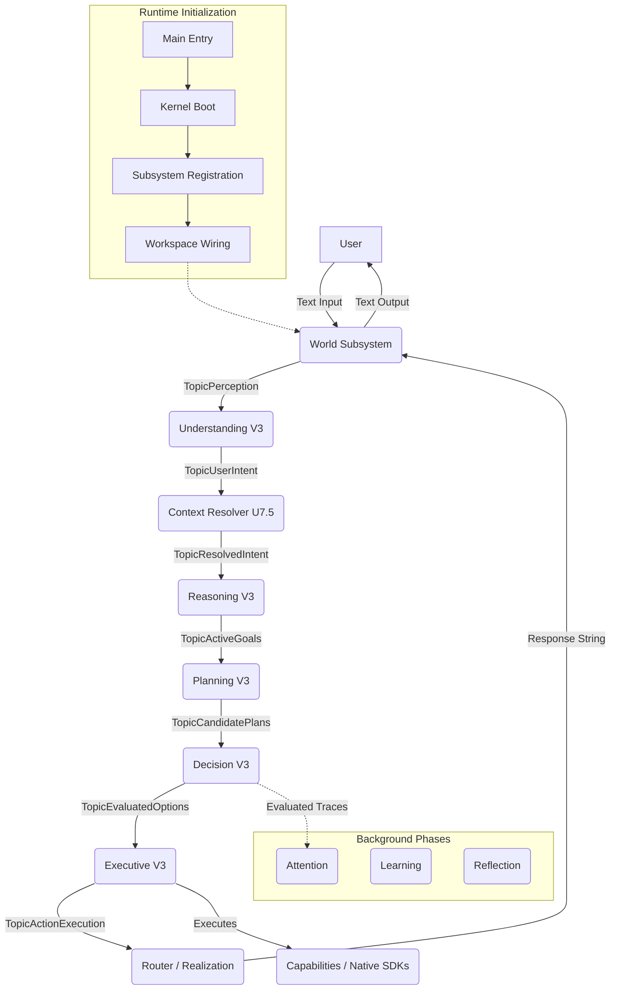
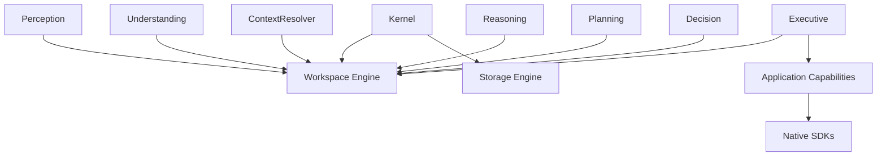

# IDUN Canonical System Architecture

This document is the canonical architectural reference for IDUN. It describes the **actual implemented architecture**, discovered through a comprehensive codebase audit of the runtime and cognitive pipelines.

## 1. Architectural Principles
- **Single Responsibility Principle**: Each subsystem owns a discrete phase of cognition (e.g., Parsing, Resolving, Planning, Executing).
- **Separation of Concerns**: Cognitive interpretation (Understanding) is strictly separated from execution orchestration (Executive).
- **Deterministic before AI**: Fast, deterministic rules and grammar take precedence. Probabilistic inference (LLMs) is used only as a fallback or in deliberative specialists.
- **Offline-first**: Cognitive pipelines process data locally via standardized models (e.g., local Ollama endpoints).
- **Data-driven configuration**: Splitting rules, policies, and semantic mappings are managed via registries, not hardcoded conditionals.
- **Modular design**: Dependencies are injected via interfaces, allowing individual components (e.g., Context Resolver) to be swapped without affecting the pipeline.
- **Pub/Sub Workspace architecture**: Subsystems interact purely via asynchronous `Envelope` payloads published to orthogonal `TopicID` channels on the Global Workspace blackboard.
- **Executive as a pure orchestrator**: The Executive coordinates validation and execution but does **not** evaluate logic, language, or user intent.
- **Loose coupling**: Subsystems know nothing about each other's internals.
- **Test-first certification**: Rigorous benchmark and regression testing gates all pipeline transitions.

---

## 2. Request Lifecycle & Runtime Flow

The following flow represents the true path of a request through IDUN, from the main entry point to the final response.

### Detailed Initialization Order (from `host.go`)
1. **Core**: Storage, Memory, Scheduler.
2. **Foundation**: Registry, Bus, Boundary, Permission, Constitution, Calibration, Inference (LLM bridges).
3. **Workspace**: Global Event Engine.
4. **Executive**: Executive orchestration and Attention tracing.
5. **Cognitive Pipeline**: Understanding, ContextResolver, Reasoning, Planning, Decision.
6. **Background/World**: Reflection, Learning, Router (Realization), World (I/O).

---

## 3. Data Flow Evolution

Data structurally evolves as it travels through the Workspace topics:

1. **Raw User Input**: `"Turn off the lights and set an alarm for tomorrow"`
   *↓ (World Text Adapter)*
2. **`perception.PerceptionEnvelope`**
   *↓ (Understanding / Splitter / Cascade)*
3. **`underv3.UnderstandingBatch`** (Multiple unstructured intents)
   *↓ (Context Resolver)*
4. **`underv3.UnderstandingBatch`** (With `ResolutionStatus` and resolved pronouns)
   *↓ (Reasoning)*
5. **`[]*reasoningv3.ReasoningContext`** (Active semantic goals)
   *↓ (Planning)*
6. **`planningv3.ExecutionPlan`** (Hierarchical Task Network)
   *↓ (Decision)*
7. **`decisionv3.DecisionRecord`** (Authorized/Budgeted Plan)
   *↓ (Executive)*
8. **`executivev3.ExecutionResult`** (Execution outcome)
   *↓ (Router/Realization)*
9. **Final Output String**

---

## 4. Workspace Topics Dictionary

| Topic Name | Publisher(s) | Subscriber(s) | Payload Type | Purpose |
|------------|--------------|---------------|--------------|---------|
| `TopicPerception` | World / Adapters | Understanding | `PerceptionEnvelope` | Carries raw, uninterpreted sensory stimuli (text). |
| `TopicUserIntent` | Understanding | Context Resolver | `UnderstandingBatch` | Carries parsed multi-intent structures. |
| `TopicResolvedIntent`| Context Resolver | Reasoning | `UnderstandingBatch` | Carries intents with grounded contextual references (pronouns, time). |
| `TopicActiveGoals` | Reasoning | Planning, Attention | `[]*ReasoningContext` | Carries logically validated goals derived from intents. |
| `TopicCandidatePlans`| Planning | Decision, Attention | `ExecutionPlan` | Carries generated action sequences (HTNs). |
| `TopicEvaluatedOptions`| Decision | Executive, Attention| `DecisionRecord` | Carries approved/rejected plans with budget and safety authorization. |
| `TopicActionExecution`| Executive | Router, Realization, World | `ExecutionResult` | Carries finalized execution states used to generate user feedback. |

---

## 5. Major Cognitive Subsystems

### Understanding (U-Series)
- **Purpose**: Parses unstructured natural language into structured, deterministic semantic intents.
- **Responsibilities**: Normalization, Protected Span Detection (temporal bounds), O(N) Splitting, Specialist Cascade (Grammar -> Neural -> Deliberative), Semantic Slot Extraction.
- **What it owns**: Linguistic boundaries, connector registries, parsing logic, and `UnderstandingBatch` generation.
- **What it MUST NEVER do**: Execute actions, perform mathematical evaluation, reason about world state, resolve historical pronouns, or formulate plans.
- **Inputs**: `TopicPerception`
- **Outputs**: `TopicUserIntent`
- **Current Status**: U8 Multi-Intent Implementation.
- **Future TODOs**: U8.5 (Raw Input Preservation), U9 (Recovery & Clarification).

### Context (U7)
- **Purpose**: Bridges stateless language parsing with stateful dialogue history.
- **Responsibilities**: Resolves pronouns (e.g., "it"), ellipses (missing verbs/nouns), relative time anchors, and confirmation states ("yes/no").
- **What it owns**: Context resolution strategies and mutation of the `ResolutionStatus`.
- **What it MUST NEVER do**: Infer intents from scratch, plan multi-step actions, or execute native capabilities.
- **Inputs**: `TopicUserIntent`
- **Outputs**: `TopicResolvedIntent`
- **Current Status**: U7.5 Frozen.
- **Future TODOs**: Upgrade `ResolvedEntities` from `map[string]string` to a formal type structure. 

### Reasoning (V3)
- **Purpose**: Transforms user intent into logical goals by verifying constraints and aligning with system capabilities.
- **Responsibilities**: Applying logic, memory integration, and deliberative escalation for complex, ambiguous tasks.
- **What it owns**: `ReasoningContext` generation and logical grounding.
- **What it MUST NEVER do**: Execute capabilities or handle raw language parsing.
- **Inputs**: `TopicResolvedIntent`
- **Outputs**: `TopicActiveGoals`
- **Current Status**: V3 Operational.

### Planning (V3)
- **Purpose**: Creates actionable steps to satisfy active goals.
- **Responsibilities**: Generates Hierarchical Task Networks (HTNs) and maps goals to concrete tool sequences.
- **What it owns**: `ExecutionPlan` artifacts.
- **What it MUST NEVER do**: Authorize its own plans or execute them directly.
- **Inputs**: `TopicActiveGoals`
- **Outputs**: `TopicCandidatePlans`
- **Current Status**: V3 Operational.

### Decision (V3)
- **Purpose**: Gatekeeper for system safety, authorization, and budgeting.
- **Responsibilities**: Evaluates candidate plans against the Constitution, user permissions, and compute budgets.
- **What it owns**: `DecisionRecord` authorization and `StatusApproved`/`StatusRejected` states.
- **What it MUST NEVER do**: Modify the plan logic or execute the plan.
- **Inputs**: `TopicCandidatePlans`
- **Outputs**: `TopicEvaluatedOptions`
- **Current Status**: V3 Operational.

### Executive (V3)
- **Purpose**: Pure execution orchestrator.
- **Responsibilities**: Dispatches authorized plans to native Application Capabilities and collects execution outcomes.
- **What it owns**: `ExecutionResult` and process lifetime management.
- **What it MUST NEVER do**: Perform ANY cognitive interpretation, parsing, reasoning, or semantic modeling.
- **Inputs**: `TopicEvaluatedOptions`
- **Outputs**: `TopicActionExecution`
- **Current Status**: V3 Operational.

---

## 6. Module Dependency Graph

All subsystems are strictly decoupled. They interact ONLY via the Workspace and Storage engines.

